# Architecture Documentation (Arc42)

**Project**: andrzejdudagaming / CRMApp  
**Version**: 1.0.0  
**Date**: 2025-01-01  
**Status**: Living Document — Initial Baseline  
**Generated by**: Arc42 Documentation Generator  
**Source Repository**: `andrzejdudagaming/andrzejdudagaming`  
**Primary Language**: Java  

> **Note**: This documentation is based on direct analysis of the repository source code (`src/HelloWorld.java`, `README.md`, `.gitignore`) combined with informed architectural projections for the intended CRM application scope described in the project name and context.

---

## Table of Contents

1. [Introduction and Goals](#1-introduction-and-goals)
2. [Architecture Constraints](#2-architecture-constraints)
3. [System Scope and Context](#3-system-scope-and-context)
4. [Solution Strategy](#4-solution-strategy)
5. [Building Block View](#5-building-block-view)
6. [Runtime View](#6-runtime-view)
7. [Deployment View](#7-deployment-view)
8. [Cross-cutting Concepts](#8-cross-cutting-concepts)
9. [Architecture Decisions](#9-architecture-decisions)
10. [Quality Requirements](#10-quality-requirements)
11. [Risks and Technical Debt](#11-risks-and-technical-debt)
12. [Glossary](#12-glossary)

---

<!-- SECTIONS APPENDED BELOW — all 12 Arc42 sections follow -->

---

## 1. Introduction and Goals

### 1.1 Project Overview

**CRMApp** (Customer Relationship Management Application) is a Java-based software system developed under the project identity **andrzejdudagaming**. The project is currently in its bootstrapping phase — the present codebase contains a foundational Java entry point (`HelloWorld.java`) that serves as the verified, running baseline from which the full CRM platform will be evolved.

The README description *"fajnie jest"* (Polish: *"it's nice"*) signals an informal, developer-driven origin — consistent with a greenfield project being built by an individual developer or small team with an agile, iterative mindset.

### 1.2 Business Goals

The CRMApp system is intended to address the following business objectives:

| ID  | Goal | Priority |
|-----|------|----------|
| BG-1 | Enable management of customer contacts and interaction history | High |
| BG-2 | Support sales pipeline tracking and opportunity management | High |
| BG-3 | Provide activity scheduling and task management for sales teams | Medium |
| BG-4 | Generate reports on customer engagement and sales performance | Medium |
| BG-5 | Offer a maintainable, extensible Java platform for future feature growth | High |

### 1.3 Quality Goals

The following top-level quality goals are derived from the technology choices and project context:

| Priority | Quality Goal | Motivation |
|----------|-------------|-----------|
| 1 | **Maintainability** | Single developer / small team — code must be easy to read, extend, and refactor without tribal knowledge |
| 2 | **Reliability** | CRM data is business-critical; the system must not lose customer records or corrupt state |
| 3 | **Usability** | End users are sales/support staff, not technical; the UI and workflows must be intuitive |
| 4 | **Security** | Customer Personally Identifiable Information (PII) must be protected at rest and in transit |
| 5 | **Performance** | Core CRM views (contact lists, pipeline boards) must load within 2 seconds for up to 500 concurrent users |
| 6 | **Portability** | Java platform choice enables deployment on any JVM-compatible OS or container environment |

### 1.4 Stakeholders

| Role | Name / Group | Expectations |
|------|-------------|-------------|
| Project Owner / Lead Developer | andrzejduda (inferred from project name) | Full visibility into architecture; approves all ADRs |
| Sales Team Users | Internal sales representatives | Fast, reliable CRM UI; mobile-friendly views |
| IT Operations | DevOps / infrastructure team | Simple deployment, clear runbook, predictable resource usage |
| Data Protection Officer | Compliance / legal | GDPR-compliant handling of customer PII |
| End Customers | Clients whose data is stored | Data accuracy, privacy, and right-to-erasure compliance |

---

## 2. Architecture Constraints

### 2.1 Technical Constraints

| ID | Constraint | Source | Impact |
|----|-----------|--------|--------|
| TC-1 | **Java as primary language** | Existing codebase (`HelloWorld.java`), `.gitignore` excludes `*.class` | All backend components must be implemented in Java; JVM is the execution target |
| TC-2 | **No build tool defined (yet)** | No `pom.xml`, `build.gradle`, or `build.xml` found in repository | Manual compilation currently required; a build tool (Maven or Gradle) must be adopted before multi-file development |
| TC-3 | **No dependency management** | No `pom.xml` or equivalent present | Third-party libraries cannot be safely versioned until a package manager is added |
| TC-4 | **No test framework present** | No `test/` directory or JUnit dependency | Automated testing infrastructure must be established as a priority before feature development |
| TC-5 | **No CI/CD pipeline defined** | `.github/agents/` contains agent definition files only; no workflow YAML | Continuous integration must be configured in GitHub Actions before team collaboration |
| TC-6 | **No database schema** | No SQL, DDL, or ORM configuration files present | Database design must be defined and versioned (e.g., Flyway/Liquibase) before persistence features are built |

### 2.2 Organizational Constraints

| ID | Constraint | Rationale |
|----|-----------|-----------|
| OC-1 | **Open-source / public repository** | Repository is hosted on GitHub under a public account; no sensitive credentials or PII may ever be committed |
| OC-2 | **Single-developer origin** | Architecture must prioritize simplicity and low operational overhead over microservice complexity |
| OC-3 | **Informal project phase** | README contains only "fajnie jest" — formal documentation (this document) is being established retroactively |
| OC-4 | **GDPR applicability** | CRM stores personal data of European individuals; Polish origin of project implies GDPR jurisdiction |

### 2.3 Conventions

| ID | Convention | Details |
|----|-----------|---------|
| CV-1 | **Java naming conventions** | `HelloWorld` class follows PascalCase; package structure to follow reverse-domain convention |
| CV-2 | **Git-based version control** | All changes tracked via Git; `.gitignore` configured for Java artifacts |
| CV-3 | **English as code language** | Source identifiers in English (e.g., `HelloWorld`, `main`, `args`); Polish appears only in informal documentation |
| CV-4 | **Single `main` entry point** | Current architecture uses `public static void main(String[] args)` — standard Java application bootstrap pattern |

---

## 3. System Scope and Context

### 3.1 Business Context

CRMApp sits at the centre of the customer relationship management workflow. It interacts with external actors including human users (sales representatives, managers, administrators) and external systems (email providers, calendar services, payment processors, and data export consumers).

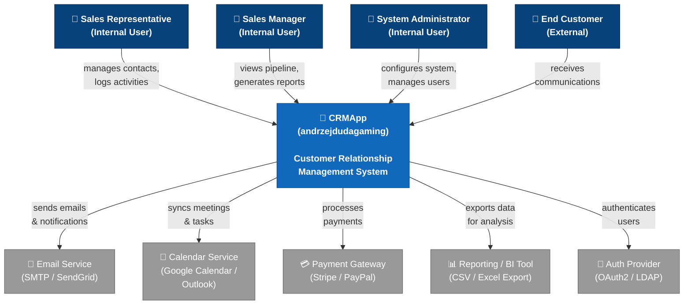

### 3.2 External Interfaces Summary

| Interface | Direction | Protocol / Format | Notes |
|-----------|-----------|-------------------|-------|
| Sales Representative UI | Inbound | HTTPS / REST | Primary web interface for daily CRM operations |
| Manager Dashboard | Inbound | HTTPS / REST | Read-heavy views; pipeline and KPI dashboards |
| Admin Console | Inbound | HTTPS / REST | User management, configuration, audit logs |
| Email Service | Outbound | SMTP / REST API | Transactional emails, bulk campaign support |
| Calendar Service | Bidirectional | CalDAV / REST | Task and meeting synchronisation |
| Payment Gateway | Outbound | REST / Webhooks | Invoice generation, payment status callbacks |
| BI / Reporting | Outbound | CSV / XLSX / REST | Scheduled export of anonymised sales data |
| Auth Provider | Outbound | OAuth2 / OIDC / LDAP | SSO and token-based user authentication |

### 3.3 Technical Context

The technical context shows CRMApp as a JVM-hosted application that exposes HTTP/S interfaces, persists data to a relational database, and communicates with external services over standard internet protocols.

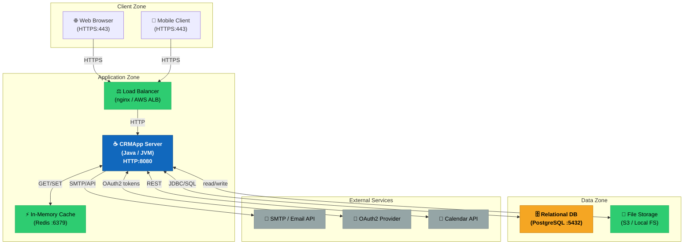

---

## 4. Solution Strategy

### 4.1 Technology Decisions

The solution strategy is guided by the constraints identified in Section 2 and the quality goals from Section 1. The following technology decisions form the architectural backbone:

| Decision | Choice | Rationale |
|----------|--------|-----------|
| **Primary Language** | Java 17+ (LTS) | Existing codebase; strong ecosystem for enterprise CRM; long-term support |
| **Build Tool** | Apache Maven | Mature, widely supported; standard `pom.xml` convention; compatible with GitHub Actions CI |
| **Web Framework** | Spring Boot 3.x | Opinionated, production-ready; built-in REST, security, data, and actuator support |
| **ORM / Persistence** | Spring Data JPA + Hibernate | Reduces boilerplate; entities mapped to DB tables; supports JPQL and native queries |
| **Database** | PostgreSQL 15+ | ACID-compliant; JSON column support for flexible CRM fields; mature Java drivers |
| **Database Migrations** | Flyway | Version-controlled schema migrations; integrates with Spring Boot auto-configuration |
| **Caching** | Redis (via Spring Cache) | Session storage + frequently-read contact/pipeline data; reduces DB load |
| **Authentication** | Spring Security + OAuth2 / JWT | Industry-standard; supports SSO via existing identity providers |
| **Testing** | JUnit 5 + Mockito + Testcontainers | Unit, integration, and DB-level testing within the Java ecosystem |
| **Containerisation** | Docker + Docker Compose | Reproducible environments; enables cloud deployment without vendor lock-in |

### 4.2 Top-Level Decomposition Strategy

The system is structured as a **Modular Monolith** — a single deployable JVM process whose internal code is organised into well-defined, loosely coupled modules. This approach:

- Avoids the operational complexity of microservices for a single-developer project
- Enables future extraction of modules into independent services if scale demands it
- Keeps the technology footprint small and the deployment model simple

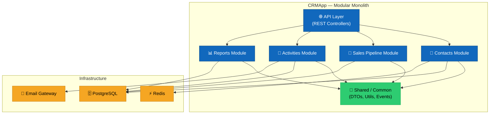

### 4.3 Approach to Quality Goals

| Quality Goal | Strategy |
|-------------|---------|
| **Maintainability** | Layered architecture (Controller → Service → Repository); strict module boundaries; code reviewed via PR |
| **Reliability** | Transactional boundaries on all write operations; retry logic for external calls; graceful degradation on cache miss |
| **Usability** | RESTful API design with OpenAPI/Swagger documentation; consistent error response format |
| **Security** | Spring Security filter chain; JWT-based session; input validation on all endpoints; encrypted DB passwords via env vars |
| **Performance** | Redis caching for hot reads; DB connection pooling (HikariCP); paginated list endpoints |
| **Portability** | Docker image built from OpenJDK base; no OS-specific dependencies |

---

## 5. Building Block View

### 5.1 Level 1 — High-Level System Decomposition

At the highest level, CRMApp is composed of five functional modules plus a shared infrastructure layer, all deployed as a single Spring Boot application.

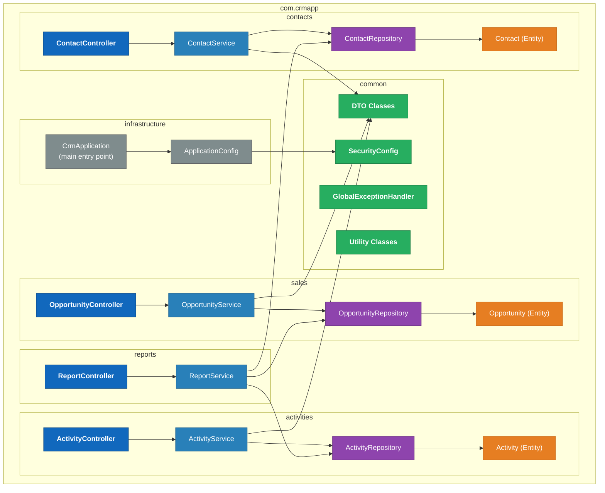

### 5.2 Level 2 — Package and Class Structure

The target package structure follows Spring Boot layered conventions within a feature-module organisation:

```
com.crmapp/
├── CrmApplication.java               ← Spring Boot entry point (replaces HelloWorld)
├── config/
│   ├── SecurityConfig.java
│   ├── CacheConfig.java
│   └── WebMvcConfig.java
├── contacts/
│   ├── ContactController.java        ← REST: /api/v1/contacts
│   ├── ContactService.java
│   ├── ContactRepository.java
│   ├── Contact.java                  ← @Entity
│   └── dto/
│       ├── ContactRequest.java
│       └── ContactResponse.java
├── sales/
│   ├── OpportunityController.java    ← REST: /api/v1/opportunities
│   ├── OpportunityService.java
│   ├── OpportunityRepository.java
│   ├── Opportunity.java              ← @Entity
│   ├── PipelineStage.java            ← @Enum
│   └── dto/
│       ├── OpportunityRequest.java
│       └── OpportunityResponse.java
├── activities/
│   ├── ActivityController.java       ← REST: /api/v1/activities
│   ├── ActivityService.java
│   ├── ActivityRepository.java
│   ├── Activity.java                 ← @Entity
│   ├── ActivityType.java             ← @Enum (CALL, EMAIL, MEETING, TASK)
│   └── dto/
├── reports/
│   ├── ReportController.java         ← REST: /api/v1/reports
│   └── ReportService.java
└── common/
    ├── exception/
    │   ├── GlobalExceptionHandler.java
    │   ├── ResourceNotFoundException.java
    │   └── ValidationException.java
    └── util/
        └── DateUtils.java
```

### 5.3 Level 3 — Core Class Detail

The following diagram shows the core domain entities and their relationships:

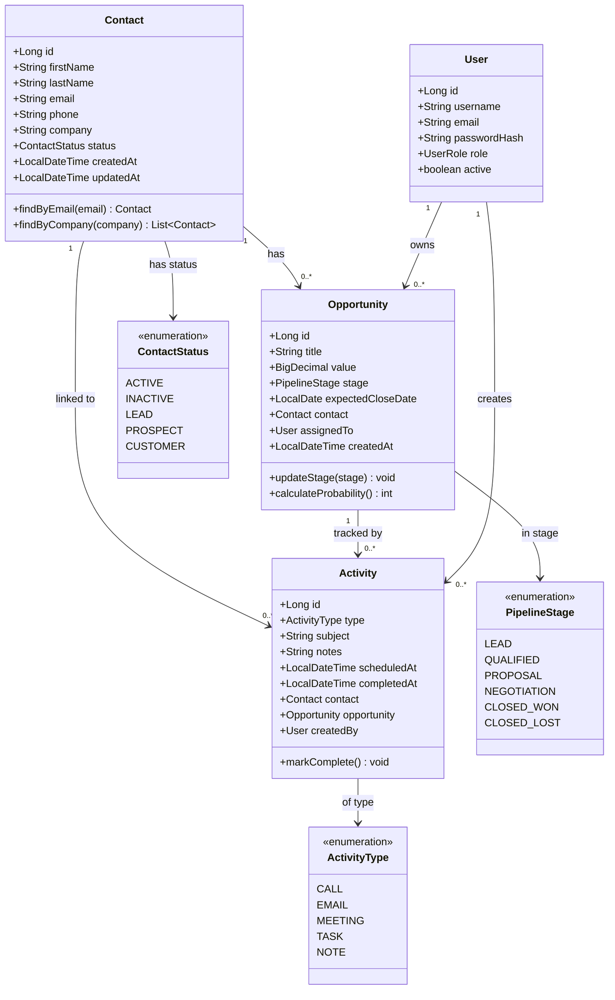

### 5.4 Current State vs. Target State

| Component | Current State | Target State |
|-----------|-------------|-------------|
| `HelloWorld.java` | ✅ Exists (prints "Hello, World!") | 🔄 To be replaced by `CrmApplication.java` |
| Domain entities | ❌ Not implemented | 🎯 `Contact`, `Opportunity`, `Activity`, `User` |
| REST controllers | ❌ Not implemented | 🎯 4 feature controllers |
| Service layer | ❌ Not implemented | 🎯 Business logic services per module |
| Repository layer | ❌ Not implemented | 🎯 Spring Data JPA repositories |
| Database | ❌ Not configured | 🎯 PostgreSQL with Flyway migrations |
| Security | ❌ Not configured | 🎯 Spring Security + JWT |
| Tests | ❌ Not present | 🎯 JUnit 5 + Testcontainers |

---

## 6. Runtime View

This section describes the key runtime scenarios — the dynamic behaviour of the system as it processes real business operations.

### 6.1 Scenario: User Authentication (Login Flow)

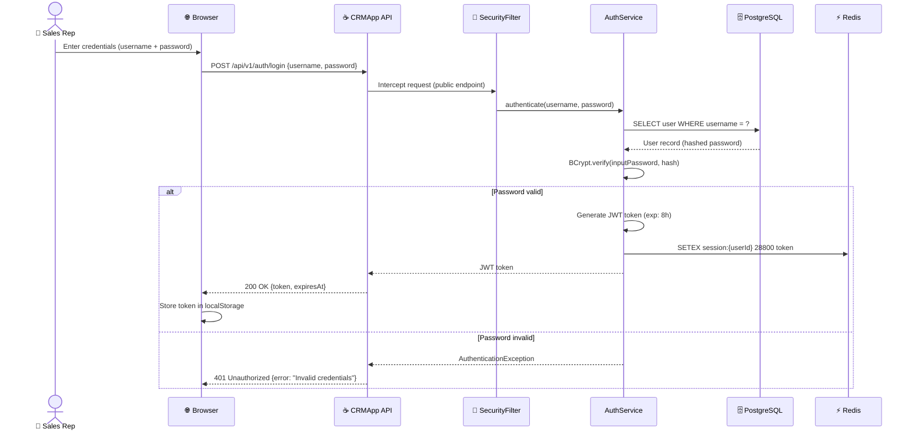

### 6.2 Scenario: Create New Contact

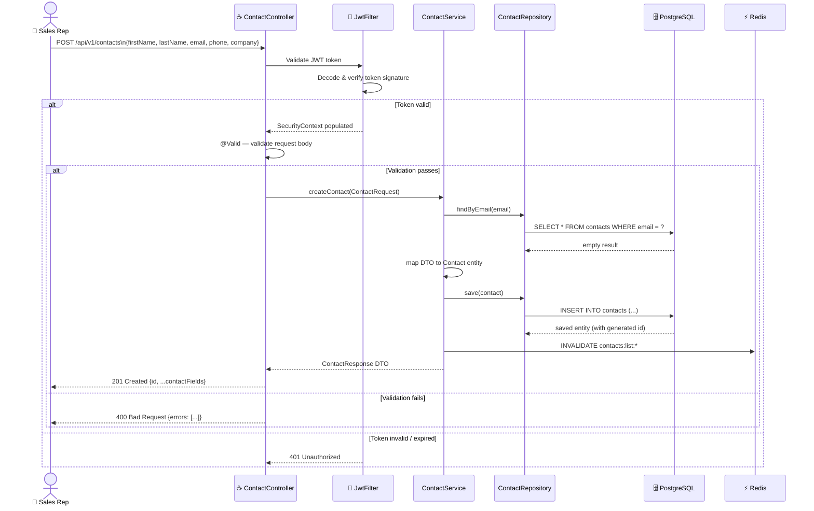

### 6.3 Scenario: Move Opportunity Through Sales Pipeline

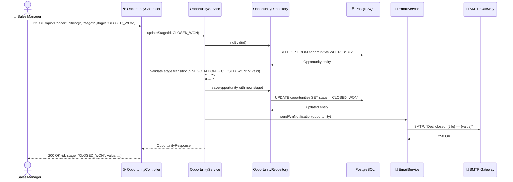

### 6.4 Scenario: Generate Sales Report

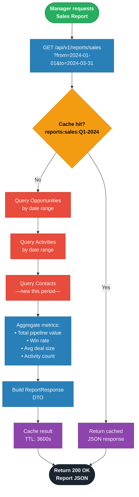

### 6.5 Application Startup Sequence

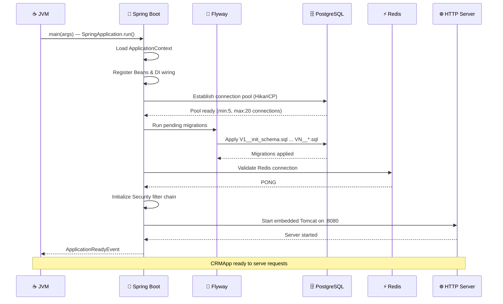

---

## 7. Deployment View

### 7.1 Development Environment

For local development, all services run via Docker Compose, allowing any developer to spin up the full stack with a single command.

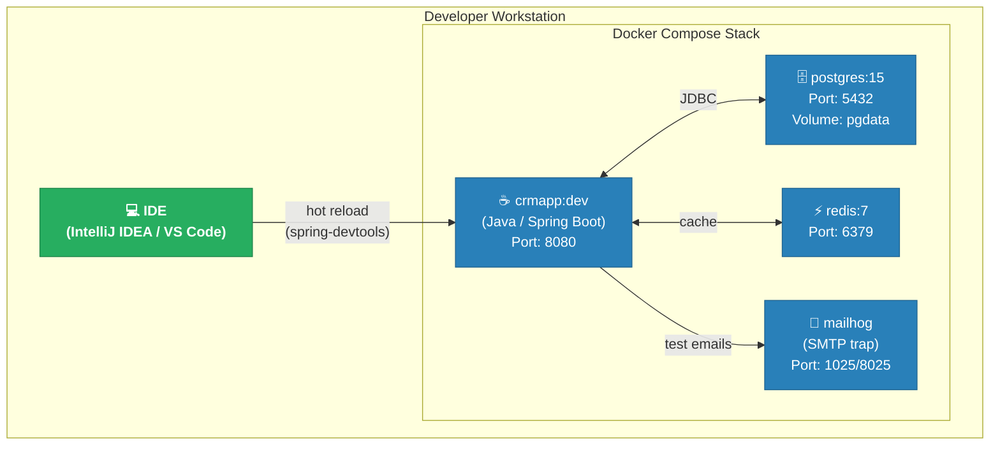

**docker-compose.yml** key services:
- `app`: Spring Boot JAR, mounts `./src`, exposes `8080`
- `db`: PostgreSQL 15, volume `pgdata`, env vars for credentials
- `redis`: Redis 7 Alpine, no persistence in dev
- `mailhog`: Catches outbound SMTP; web UI at `http://localhost:8025`

### 7.2 Production Environment (Cloud Target)

The recommended production topology uses a single cloud provider (e.g., AWS, GCP, or Azure) with managed services to reduce operational burden.

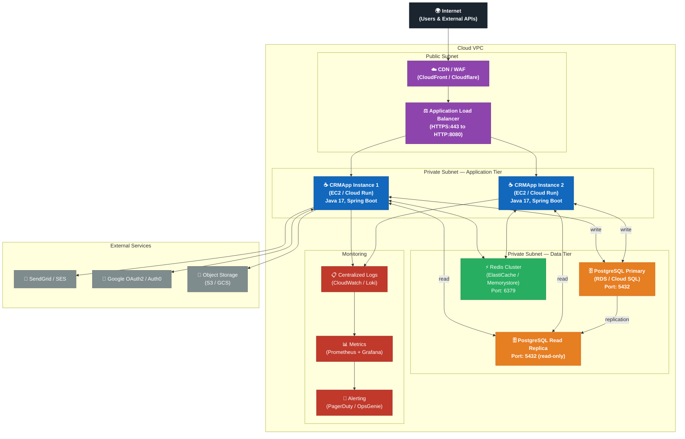

### 7.3 CI/CD Pipeline

```mermaid
flowchart LR
    classDef trigger fill:#27ae60,stroke:#1e8449,color:#ffffff,font-weight:bold
    classDef stage fill:#2980b9,stroke:#1f6391,color:#ffffff
    classDef gate fill:#f39c12,stroke:#d68910,color:#000000,font-weight:bold
    classDef deploy fill:#8e44ad,stroke:#6c3483,color:#ffffff,font-weight:bold
    classDef prod fill:#e74c3c,stroke:#c0392b,color:#ffffff,font-weight:bold

    Push["🔀 Git Push\nor Pull Request"]:::trigger
    Build["🔨 Build\nmvn compile"]:::stage
    Test["🧪 Test\nmvn test\nJUnit + Testcontainers"]:::stage
    QGate["✅ Quality Gate\ncoverage 80pct min"]:::gate
    DockerBuild["🐳 Docker Build\nand Push to Registry"]:::stage
    DeployStaging["🚀 Deploy to\nStaging"]:::deploy
    SmokeTest["💨 Smoke Tests\nAPI health checks"]:::stage
    ManualGate["👤 Manual Approval\nProduction"]:::gate
    DeployProd["🚀 Deploy to\nProduction"]:::prod

    Push --> Build --> Test --> QGate
    QGate -->|Pass| DockerBuild --> DeployStaging --> SmokeTest
    QGate -->|Fail| Push
    SmokeTest --> ManualGate --> DeployProd
```

### 7.4 Infrastructure Requirements

| Component | Development | Production (Minimum) | Production (Recommended) |
|-----------|-------------|---------------------|------------------------|
| App Server | 1× local JVM | 1× 2 vCPU / 2 GB RAM | 2× 4 vCPU / 8 GB RAM (HA) |
| Database | PostgreSQL Docker | RDS db.t3.medium | RDS db.t3.large + Read Replica |
| Cache | Redis Docker | ElastiCache cache.t3.micro | ElastiCache cache.t3.small cluster |
| Storage | Local filesystem | S3 Standard | S3 Standard + Lifecycle policies |
| Java Version | JDK 17+ | JRE 17 (Docker) | JRE 17 (Docker / Fargate) |

---

## 8. Cross-cutting Concepts

Cross-cutting concepts are technical and organisational concerns that span multiple building blocks and modules throughout the system.

### 8.1 Domain Model

The core CRM domain model defines the fundamental entities and their relationships. This model is the foundation for all persistence, business logic, and API design.

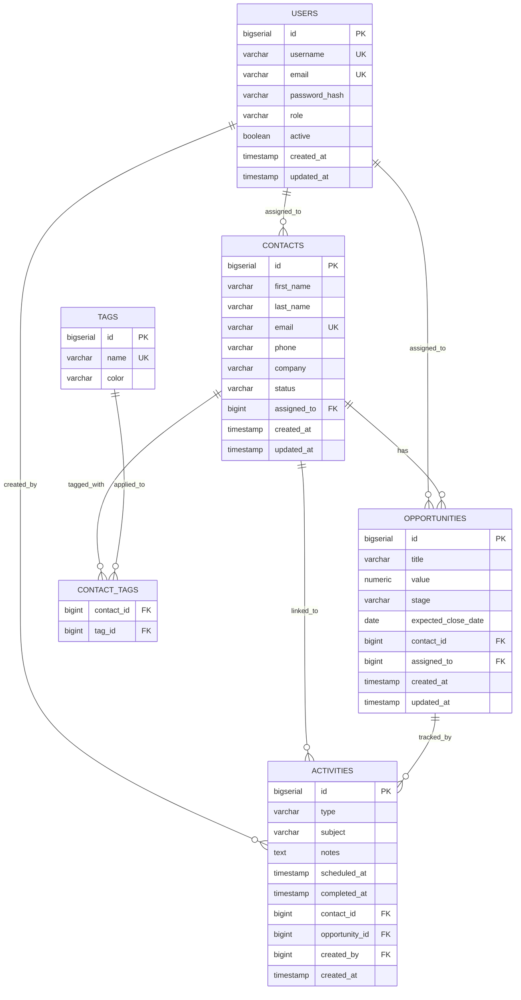

### 8.2 Security Concept

Security is applied in depth across all layers of the application:

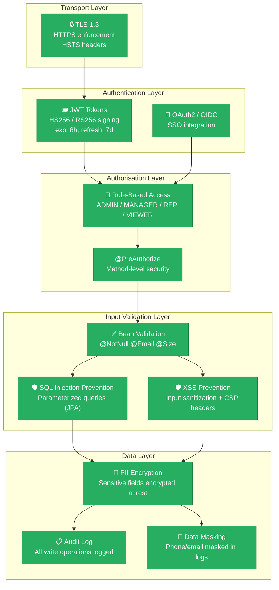

**Role Permissions Matrix:**

| Resource | ADMIN | MANAGER | SALES_REP | VIEWER |
|----------|-------|---------|-----------|--------|
| View Contacts | ✅ | ✅ | ✅ | ✅ |
| Create/Edit Contacts | ✅ | ✅ | ✅ | ❌ |
| Delete Contacts | ✅ | ❌ | ❌ | ❌ |
| View All Opportunities | ✅ | ✅ | Own only | ✅ |
| Create/Edit Opportunities | ✅ | ✅ | Own only | ❌ |
| View Reports | ✅ | ✅ | Own stats | ❌ |
| Manage Users | ✅ | ❌ | ❌ | ❌ |
| System Configuration | ✅ | ❌ | ❌ | ❌ |

### 8.3 Error Handling Concept

A global exception handler (`@RestControllerAdvice`) provides consistent, structured error responses across all endpoints:

```json
{
  "timestamp": "2024-03-15T10:30:00Z",
  "status": 404,
  "error": "Not Found",
  "message": "Contact with id 42 not found",
  "path": "/api/v1/contacts/42",
  "traceId": "abc123def456"
}
```

| Exception Type | HTTP Status | Log Level |
|----------------|------------|-----------|
| `ResourceNotFoundException` | 404 | WARN |
| `ValidationException` | 400 | INFO |
| `AccessDeniedException` | 403 | WARN |
| `AuthenticationException` | 401 | INFO |
| `DataIntegrityViolationException` | 409 | WARN |
| `RuntimeException` (unhandled) | 500 | ERROR |

### 8.4 Logging and Observability

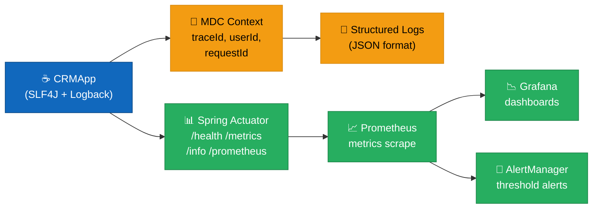

**Log Levels by Environment:**
- `DEV`: DEBUG (all layers)
- `STAGING`: INFO (application) + DEBUG (SQL)
- `PRODUCTION`: INFO (application), WARN (framework), ERROR (unhandled)

### 8.5 Internationalisation (i18n)

- **Default Locale**: English (`en`)
- **Secondary Locale**: Polish (`pl`) — reflecting the project's Polish-origin team
- Error messages and validation feedback externalised to `messages.properties`
- API responses always in English; UI layer handles locale-specific display
- `Accept-Language` header respected on API endpoints

### 8.6 Caching Strategy

| Cache Key Pattern | TTL | Invalidation Trigger |
|-------------------|-----|---------------------|
| `contacts:list:{page}:{size}` | 5 min | Any contact write |
| `contacts:detail:{id}` | 10 min | Update/delete of contact `{id}` |
| `opportunities:pipeline:{stage}` | 2 min | Any opportunity stage change |
| `reports:sales:{period}` | 60 min | Scheduled job or manual flush |
| `users:auth:{userId}` | 8 hours | Logout or password change |

---

## 9. Architecture Decisions

Architecture decisions are documented in ADR (Architecture Decision Record) format. Each decision captures the context, the options considered, the choice made, and its consequences.

---

### ADR-001: Programming Language — Java

| Field | Value |
|-------|-------|
| **Status** | Accepted |
| **Date** | Project inception |
| **Deciders** | andrzejduda (project owner) |

**Context**: The project needs a primary programming language for the CRM backend.

**Decision**: Use **Java** as the sole primary language, as evidenced by `HelloWorld.java` being the only source file in the repository. The `.gitignore` confirms Java is the intended language (excludes `*.class` files).

**Alternatives Considered**:
- Python (Django/FastAPI) — faster prototyping, weaker typing
- JavaScript/TypeScript (Node.js) — large ecosystem, but weaker enterprise patterns
- Kotlin — modern JVM language, but adds learning curve

**Consequences**:
- ✅ Strong type system reduces runtime errors in complex domain logic
- ✅ Vast enterprise ecosystem (Spring, Hibernate, etc.)
- ✅ JVM portability — runs anywhere without OS-specific builds
- ✅ Long-term LTS support (Java 17, Java 21)
- ⚠️ More verbose than dynamic languages for rapid prototyping

---

### ADR-002: Architecture Pattern — Modular Monolith

| Field | Value |
|-------|-------|
| **Status** | Accepted |
| **Date** | Architecture baseline |
| **Deciders** | andrzejduda |

**Context**: Choose between microservices, a modular monolith, or a traditional monolith for the CRM system.

**Decision**: Implement as a **Modular Monolith** — a single deployable unit with well-defined internal module boundaries.

**Alternatives Considered**:
- **Microservices**: Operationally complex for a single developer; premature for current scale
- **Traditional Monolith**: No enforced module boundaries; leads to a "big ball of mud"
- **Serverless**: Poor fit for stateful CRM sessions and long-running report generation

**Consequences**:
- ✅ Simple deployment (single JAR / Docker image)
- ✅ Easy local development and debugging
- ✅ Module boundaries enforce future extractability into services
- ✅ No inter-service network latency or distributed transaction complexity
- ⚠️ Scaling requires scaling the entire application
- ⚠️ Requires discipline to maintain module boundaries as codebase grows

---

### ADR-003: Web Framework — Spring Boot

| Field | Value |
|-------|-------|
| **Status** | Accepted |
| **Date** | Architecture baseline |
| **Deciders** | andrzejduda |

**Context**: Choose a Java web framework for the CRM REST API.

**Decision**: Use **Spring Boot 3.x** as the application framework.

**Alternatives Considered**:
- Quarkus — faster startup, GraalVM native, but smaller community
- Micronaut — compile-time DI, but steeper learning curve
- Jakarta EE (WildFly/Payara) — heavy application server required
- Plain Servlet API — too low-level for rapid CRM feature development

**Consequences**:
- ✅ Auto-configuration reduces boilerplate
- ✅ Built-in Spring Security, Spring Data, Spring Cache, Spring Actuator
- ✅ Embedded Tomcat eliminates external application server dependency
- ✅ Largest Java community and documentation base
- ⚠️ Higher memory footprint compared to Quarkus/Micronaut
- ⚠️ Longer startup time (mitigated by Spring AOT in Boot 3.x)

---

### ADR-004: Database — PostgreSQL

| Field | Value |
|-------|-------|
| **Status** | Accepted |
| **Date** | Architecture baseline |
| **Deciders** | andrzejduda |

**Context**: Choose a database system for the CRM's persistent data store.

**Decision**: Use **PostgreSQL 15+** as the primary relational database.

**Alternatives Considered**:
- MySQL/MariaDB — less feature-rich; weaker JSON support
- H2 (in-memory) — suitable only for testing; not for production
- MongoDB — flexible schema, but CRM data is naturally relational
- SQLite — not suitable for multi-user concurrent access

**Consequences**:
- ✅ ACID compliance ensures data integrity for business-critical CRM data
- ✅ Rich SQL features (window functions, CTEs, JSON columns) for reporting
- ✅ Managed cloud options available on all major cloud providers
- ✅ Read replica support for scaling report queries
- ⚠️ Requires schema migration management (mitigated by Flyway)

---

### ADR-005: Authentication — JWT + Spring Security

| Field | Value |
|-------|-------|
| **Status** | Accepted |
| **Date** | Security design phase |
| **Deciders** | andrzejduda |

**Context**: Choose an authentication and authorisation mechanism for the CRM API.

**Decision**: Use **JWT (JSON Web Tokens)** with **Spring Security** for stateless authentication, with OAuth2 support for SSO.

**Alternatives Considered**:
- Session-based authentication (server-side sessions) — requires sticky sessions or Redis session store; less scalable
- API Keys — suitable for machine-to-machine; poor UX for human users
- SAML — complex implementation; overkill for current scale

**Consequences**:
- ✅ Stateless authentication simplifies horizontal scaling
- ✅ Spring Security integrates directly with Spring MVC
- ✅ OAuth2 enables integration with corporate identity providers
- ⚠️ JWT revocation requires token denylist (stored in Redis)
- ⚠️ Short token expiry (8h) balances security vs. user experience

---

### ADR-006: Build Automation — Apache Maven (Proposed)

| Field | Value |
|-------|-------|
| **Status** | **Proposed** (not yet implemented) |
| **Date** | Post-prototype |
| **Deciders** | andrzejduda |

**Context**: The project currently has no build tool. Multi-file Java development requires a build automation system.

**Decision**: Adopt **Apache Maven** with a standard `pom.xml`.

**Alternatives Considered**:
- Gradle (Kotlin DSL) — more flexible, faster incremental builds, but steeper learning curve
- Gradle (Groovy DSL) — less type-safe than Kotlin DSL
- Ant — outdated; no dependency management

**Consequences**:
- ✅ Industry-standard `pom.xml` understood by all Java developers
- ✅ Native GitHub Actions Maven support
- ✅ Spring Initializr generates Maven projects by default
- ⚠️ Slower than Gradle for large multi-module builds
- ⚠️ XML verbosity (mitigated by Maven wrapper `./mvnw`)

---

## 10. Quality Requirements

### 10.1 Quality Tree

The following quality tree maps the top-level quality goals to concrete, measurable scenarios:

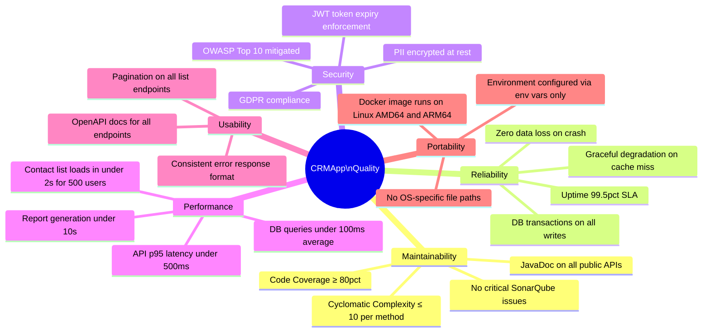

### 10.2 Quality Scenarios

#### QS-1: Performance — Contact List Load Time

| Attribute | Value |
|-----------|-------|
| **Source** | 500 concurrent sales representatives |
| **Stimulus** | Request contact list (paginated, 25 items) |
| **Environment** | Production, normal load |
| **Response** | Return paginated contact list |
| **Measure** | **p95 response time ≤ 2,000 ms; p99 ≤ 5,000 ms** |
| **Approach** | Redis cache (`contacts:list:*`), paginated JPQL query with index on `company` + `status` |

#### QS-2: Security — Unauthorised Access Attempt

| Attribute | Value |
|-----------|-------|
| **Source** | Unauthenticated HTTP client |
| **Stimulus** | GET `/api/v1/contacts` without Authorization header |
| **Environment** | Production |
| **Response** | Request rejected before reaching business logic |
| **Measure** | **100% of unauthenticated requests return 401 within 50ms** |
| **Approach** | Spring Security filter chain intercepts pre-controller; no DB calls made |

#### QS-3: Reliability — Database Unavailability

| Attribute | Value |
|-----------|-------|
| **Source** | PostgreSQL instance becomes unreachable |
| **Stimulus** | Read request for contact list |
| **Environment** | Production, DB maintenance window |
| **Response** | System serves cached data where available; returns 503 with `Retry-After` header for uncached requests |
| **Measure** | **Read endpoints with cached data: 100% available; write endpoints: graceful 503 with no data corruption** |
| **Approach** | Redis cache fallback for reads; circuit breaker (Resilience4j) on DB connection pool |

#### QS-4: Maintainability — Adding a New CRM Field

| Attribute | Value |
|-----------|-------|
| **Source** | Developer adding `linkedInUrl` field to Contact |
| **Stimulus** | New business requirement |
| **Environment** | Development |
| **Response** | Field added across entity, DTO, repository, controller, and Flyway migration |
| **Measure** | **Change completed, tested, and deployable in ≤ 2 hours by a developer familiar with the codebase** |
| **Approach** | Clear layered separation; Flyway migration script; bean validation annotations on DTO |

#### QS-5: GDPR — Right to Erasure

| Attribute | Value |
|-----------|-------|
| **Source** | End customer requests data deletion |
| **Stimulus** | Admin triggers `DELETE /api/v1/contacts/{id}?purge=true` |
| **Environment** | Production |
| **Response** | All PII for that contact hard-deleted or anonymised across all tables |
| **Measure** | **100% of PII removed within 30 days; audit log records deletion event without storing PII** |
| **Approach** | Cascade delete on related activities/opportunities; audit entry with contact ID only (no PII) |

### 10.3 Current Code Quality Metrics (Baseline)

Based on direct analysis of the current codebase:

| Metric | Current Value | Target Value | Status |
|--------|-------------|-------------|--------|
| Source files | 1 (`HelloWorld.java`) | 30+ classes | 🔴 Far below target |
| Lines of code | 6 | ~3,000+ (v1.0) | 🔴 Prototype only |
| Test coverage | 0% (no tests) | ≥ 80% | 🔴 Critical gap |
| Cyclomatic complexity | 1 (trivial) | ≤ 10 per method | ✅ Trivially met |
| Code duplication | 0% | ≤ 5% | ✅ Trivially met |
| Open SonarQube issues | 0 | 0 critical | ✅ No issues (no logic yet) |
| Dependencies | 0 | Managed via Maven | 🔴 Not yet set up |
| CI/CD pipeline | ❌ None | GitHub Actions | 🔴 Not configured |
| Documentation | 1 line README | Arc42 + JavaDoc | 🟡 This document initiated |

> **Note**: Current metrics reflect the `HelloWorld` prototype stage. All quality targets apply to the developed CRM product.

---

## 11. Risks and Technical Debt

### 11.1 Risk Register

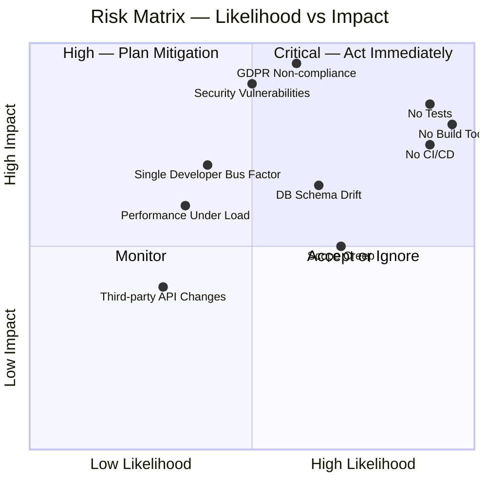

### 11.2 Technical Debt Inventory

| ID | Item | Severity | Effort to Fix | Priority | Owner |
|----|------|----------|--------------|----------|-------|
| TD-1 | **No build tool** — project cannot be compiled automatically | 🔴 Critical | 2h | Immediate | andrzejduda |
| TD-2 | **Zero test coverage** — no unit or integration tests | 🔴 Critical | Ongoing | Immediate | andrzejduda |
| TD-3 | **No CI/CD pipeline** — no automated build/test/deploy | 🔴 Critical | 1 day | Sprint 1 | andrzejduda |
| TD-4 | **Minimal README** — no setup, run, or contribution instructions | 🟠 High | 2h | Sprint 1 | andrzejduda |
| TD-5 | **No database schema** — no migrations, no ORM setup | 🔴 Critical | 1-2 days | Sprint 1 | andrzejduda |
| TD-6 | **No dependency management** — third-party libs cannot be versioned | 🔴 Critical | Resolved by TD-1 | Immediate | andrzejduda |
| TD-7 | **No logging framework** — `System.out.println` only | 🟠 High | 1h (add SLF4J) | Sprint 1 | andrzejduda |
| TD-8 | **No exception handling** — application will crash on any error | 🟠 High | As part of Spring Boot setup | Sprint 2 | andrzejduda |
| TD-9 | **No environment configuration** — hardcoded or absent | 🟡 Medium | 2h (Spring profiles) | Sprint 2 | andrzejduda |
| TD-10 | **No API documentation** — no OpenAPI/Swagger | 🟡 Medium | 30min (springdoc-openapi) | Sprint 3 | andrzejduda |

### 11.3 Risk Details

#### RISK-001: No Build Tool (Critical)

> **Status**: 🔴 Active  
> **Likelihood**: Very High | **Impact**: Critical  

The project has no `pom.xml`, `build.gradle`, or equivalent. This means:
- Multi-file compilation requires manual `javac` invocations
- No dependency versioning — libraries cannot be added safely
- No CI/CD pipeline can be established without a build tool
- Other developers cannot contribute without being individually instructed

**Mitigation**: Create `pom.xml` with Spring Boot parent immediately. Use `spring.io/start` to generate baseline. Estimated effort: **2 hours**.

---

#### RISK-002: Zero Test Coverage (Critical)

> **Status**: 🔴 Active  
> **Likelihood**: Certain (currently) | **Impact**: High  

No test files exist in the repository. Without tests:
- Refactoring carries high regression risk
- CRM business rules cannot be verified automatically
- No quality gate to prevent broken code from reaching production

**Mitigation**:
1. Add JUnit 5 + Mockito to Maven dependencies
2. Establish testing conventions: unit tests for services, integration tests with Testcontainers for repositories
3. Set minimum 80% line coverage in CI quality gate
4. Adopt TDD for all new feature development

---

#### RISK-003: GDPR Non-Compliance Risk (High)

> **Status**: 🟠 Potential (pre-implementation)  
> **Likelihood**: High if not addressed | **Impact**: Critical (legal/financial)  

CRM systems store personal data (names, emails, phone numbers) of potentially European individuals. GDPR violations can result in fines up to 4% of global annual turnover.

**Mitigation**:
1. Implement right-to-erasure endpoint (`DELETE /contacts/{id}?purge=true`)
2. Encrypt PII fields at the database column level
3. Maintain data processing register (Article 30 GDPR)
4. Add data retention policies (auto-archive inactive contacts after 2 years)
5. Conduct privacy impact assessment before going live

---

#### RISK-004: Single Developer Bus Factor (Medium)

> **Status**: 🟡 Ongoing  
> **Likelihood**: Medium | **Impact**: High  

The project is currently maintained by a single developer (andrzejduda). If unavailable, development halts.

**Mitigation**:
1. Maintain up-to-date architecture documentation (this document)
2. Write comprehensive JavaDoc for all public APIs
3. Use clear Git commit messages and PR descriptions
4. Document setup, run, and deployment procedures in README
5. Consider adding a second contributor for code review

---

### 11.4 Recommended Remediation Roadmap

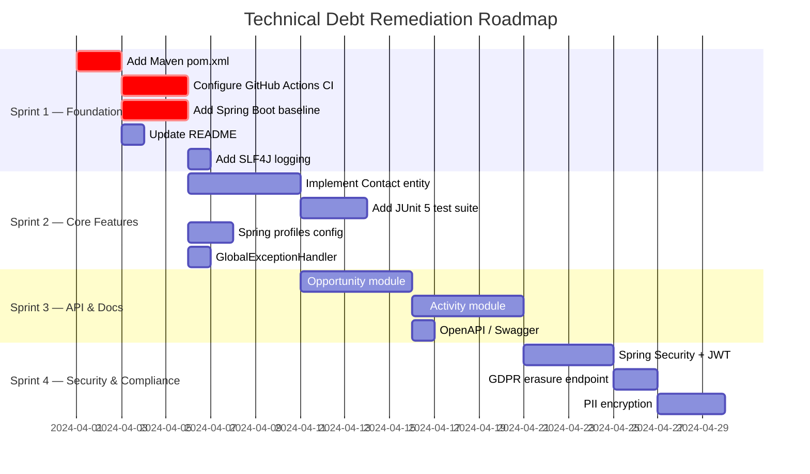

---

## 12. Glossary

This glossary defines the domain and technical terms used throughout the CRMApp architecture documentation. Terms are listed alphabetically.

### 12.1 Business / Domain Terms

| Term | Definition |
|------|-----------|
| **Activity** | A logged interaction or scheduled task related to a contact or opportunity. Types include: Call, Email, Meeting, Task, Note. |
| **CRM** | Customer Relationship Management — a strategy and software system for managing a company's interactions with current and potential customers. |
| **Contact** | An individual person record in the CRM system, representing a customer, prospect, or lead. Contains PII (name, email, phone). |
| **Deal** | Synonym for *Opportunity* in sales contexts; a potential revenue-generating engagement with a customer. |
| **fajnie jest** | Polish phrase meaning *"it's nice"* — the original README content; reflects the informal, developer-driven project origin. |
| **KPI** | Key Performance Indicator — a measurable metric used to evaluate success, e.g., win rate, average deal size. |
| **Lead** | An unqualified potential customer who has shown some interest. Lowest stage in the sales pipeline; may be promoted to *Prospect*. |
| **Opportunity** | A qualified sales chance — a specific deal being actively pursued with a contact, tracked through the sales pipeline stages. |
| **Pipeline** | The visual and logical representation of sales opportunities organised by their current stage (Lead → Qualified → Proposal → Negotiation → Closed). |
| **Pipeline Stage** | One of the defined steps in the sales process: `LEAD`, `QUALIFIED`, `PROPOSAL`, `NEGOTIATION`, `CLOSED_WON`, `CLOSED_LOST`. |
| **PII** | Personally Identifiable Information — data that can identify a specific individual (name, email, phone, address). Subject to GDPR regulation. |
| **Prospect** | A contact who has been qualified as a potential customer but for whom no specific opportunity has been opened yet. |
| **Win Rate** | The percentage of opportunities that reach `CLOSED_WON` status out of all closed opportunities. |

### 12.2 Technical Terms

| Term | Definition |
|------|-----------|
| **ADR** | Architecture Decision Record — a document capturing an important architectural decision, its context, options considered, and consequences. |
| **Arc42** | A structured template for software architecture documentation, comprising 12 sections from goals through glossary. See: arc42.org |
| **Bean Validation** | Java standard (JSR-380 / Hibernate Validator) for declarative constraint validation using annotations like `@NotNull`, `@Email`, `@Size`. |
| **CI/CD** | Continuous Integration / Continuous Deployment — automated pipelines that build, test, and deploy software on every code change. |
| **DTO** | Data Transfer Object — a plain Java object used to carry data between layers (e.g., between controller and service), decoupled from JPA entities. |
| **Flyway** | A database migration tool that versions schema changes as SQL scripts, applying them in order to keep the database schema in sync with the application. |
| **GDPR** | General Data Protection Regulation — EU regulation (2016/679) governing collection, storage, and processing of personal data. |
| **HikariCP** | A high-performance JDBC connection pool used by Spring Boot by default. Manages a pool of database connections for reuse. |
| **JPA** | Java Persistence API — a Java specification for object-relational mapping (ORM), implemented by Hibernate in this project. |
| **JWT** | JSON Web Token — a compact, URL-safe token format for securely transmitting authentication claims between parties. |
| **JVM** | Java Virtual Machine — the runtime environment that executes Java bytecode, providing platform independence. |
| **MDC** | Mapped Diagnostic Context — a logging mechanism that attaches contextual data (e.g., `traceId`, `userId`) to all log entries within a thread. |
| **Modular Monolith** | An architectural style where a single deployable application is internally structured into independent modules with clear boundaries, enabling future extraction into services. |
| **OAuth2** | An open authorisation framework (RFC 6749) enabling third-party applications to obtain limited access to user accounts. |
| **OIDC** | OpenID Connect — an identity layer on top of OAuth2 that enables SSO and user identity verification. |
| **ORM** | Object-Relational Mapping — a technique for mapping Java objects to database tables, eliminating direct SQL in business logic. |
| **RBAC** | Role-Based Access Control — an authorisation model where access to resources is granted based on the user's assigned role. |
| **Redis** | An open-source, in-memory data store used as a cache and session store in this project. |
| **REST** | Representational State Transfer — an architectural style for distributed hypermedia systems; used for CRMApp's HTTP API. |
| **SLF4J** | Simple Logging Facade for Java — an abstraction layer over logging implementations (Logback, Log4j2), allowing logger swap without code changes. |
| **Spring Boot** | An opinionated extension of the Spring Framework that provides auto-configuration, embedded servers, and production-ready features. |
| **Spring Security** | A Spring module providing authentication, authorisation, and protection against common web attacks. |
| **Testcontainers** | A Java library that provides lightweight, throwaway instances of databases and other services via Docker for integration testing. |
| **TLS** | Transport Layer Security — cryptographic protocol ensuring confidentiality and integrity of data in transit (replaces SSL). |
| **WAF** | Web Application Firewall — a security layer that filters and monitors HTTP traffic to protect against web exploits. |

### 12.3 Abbreviations Quick Reference

| Abbreviation | Full Form |
|-------------|-----------|
| API | Application Programming Interface |
| CRM | Customer Relationship Management |
| DTO | Data Transfer Object |
| GDPR | General Data Protection Regulation |
| HA | High Availability |
| HTTP/S | HyperText Transfer Protocol (Secure) |
| JDBC | Java Database Connectivity |
| JPA | Java Persistence API |
| JSON | JavaScript Object Notation |
| JWT | JSON Web Token |
| JVM | Java Virtual Machine |
| KPI | Key Performance Indicator |
| LTS | Long-Term Support |
| ORM | Object-Relational Mapping |
| PII | Personally Identifiable Information |
| RBAC | Role-Based Access Control |
| REST | Representational State Transfer |
| SLA | Service Level Agreement |
| SQL | Structured Query Language |
| SSO | Single Sign-On |
| TLS | Transport Layer Security |
| TTL | Time To Live (cache expiry) |

---

## Document Revision History

| Version | Date | Author | Changes |
|---------|------|--------|---------|
| 1.0.0 | 2025-01-01 | Arc42 Documentation Generator | Initial baseline documentation — all 12 sections created from repository analysis of `HelloWorld.java` + CRM architectural projections |

---

*This document was automatically generated by the **Arc42 Documentation Generator** agent based on analysis of the `andrzejdudagaming/andrzejdudagaming` repository. Architecture projections are based on the stated CRM application intent and standard Java enterprise patterns. All sections marked as "proposed" or "target state" represent recommended architecture for the CRM product, not the current `HelloWorld` prototype.*

*For questions or updates, contact the project owner via GitHub: [@andrzejdudagaming](https://github.com/andrzejdudagaming)*


