# Architecture Documentation (Arc42)

**Project**: andrzejdudagaming (CRM Application — CRMApp-002 Revive)
**Version**: 1.0.0
**Date**: 2025-01-01
**Generated by**: Arc42 Documentation Generator
**Status**: 🟡 Early Stage / Seed Project

> **Note**: This file should reside at `docs/arc42-architecture.md`. The `docs/` directory will be created on first commit that includes this file.

---

> **Project Motto**: *"fajnie jest"* — Polish for *"it's fun"*

---

## Table of Contents

1. [Introduction and Goals](#1-introduction-and-goals)
2. [Constraints](#2-constraints)
3. [Context and Scope](#3-context-and-scope)
4. [Solution Strategy](#4-solution-strategy)
5. [Building Block View](#5-building-block-view)
6. [Runtime View](#6-runtime-view)
7. [Deployment View](#7-deployment-view)
8. [Crosscutting Concepts](#8-crosscutting-concepts)
9. [Architecture Decisions](#9-architecture-decisions)
10. [Quality Requirements](#10-quality-requirements)
11. [Risks and Technical Debt](#11-risks-and-technical-debt)
12. [Glossary](#12-glossary)

---

## 1. Introduction and Goals

### 1.1 Requirements Overview

The **andrzejdudagaming** project is a CRM (Customer Relationship Management) application currently in its seed/revival phase, tracked under issue **CRMApp-002 — Revive**. The project is at the absolute beginning of its lifecycle, with a single Java entry-point class (`HelloWorld.java`) serving as the bootstrapping foundation.

The project name and README motto (*"fajnie jest"* — "it's fun") suggest a personal or gaming-community-oriented CRM, potentially aimed at managing player relationships, community members, or gaming-related customer data for the creator **andrzejdudagaming**.

#### Primary Goals

| # | Goal | Priority |
|---|------|----------|
| G-01 | Revive and modernise the CRM application foundation | High |
| G-02 | Establish a clean Java project structure | High |
| G-03 | Enable management of customer/community relationship data | High |
| G-04 | Provide a simple, maintainable codebase | Medium |
| G-05 | Support gaming-community-specific workflows | Medium |

### 1.2 Quality Goals

Based on the project's early stage and context, the following quality goals are prioritised (Arc42 top-5 quality goals):

| Priority | Quality Attribute | Motivation |
|----------|-------------------|------------|
| 1 | **Maintainability** | Single developer / small team — code must be easy to understand and evolve |
| 2 | **Simplicity** | Early-stage project must avoid over-engineering |
| 3 | **Correctness** | CRM data must be accurately stored and retrieved |
| 4 | **Extensibility** | Foundation must allow future feature additions (contacts, notes, activity log) |
| 5 | **Reliability** | Core CRM functions must work consistently |

### 1.3 Stakeholders

| Role | Name / Group | Expectations |
|------|--------------|--------------|
| Owner / Developer | andrzejdudagaming | Full control; drives feature development |
| End Users | Gaming community members / customers | Simple, reliable CRM interactions |
| Community Manager | andrzejdudagaming | Manage player/contact records |

---

## 2. Constraints

### 2.1 Technical Constraints

| ID | Constraint | Rationale |
|----|-----------|-----------|
| TC-01 | **Language: Java** | The sole source file is `HelloWorld.java`; Java is the chosen language |
| TC-02 | **No build system defined yet** | No `pom.xml`, `build.gradle`, or `Makefile` present — manual `javac` compilation |
| TC-03 | **No external dependencies** | The current implementation uses only `java.lang` (standard library) |
| TC-04 | **No database layer** | No DDL, ORM, or persistence layer defined at this stage |
| TC-05 | **`.class` files ignored** | `.gitignore` excludes compiled bytecode — version control tracks sources only |
| TC-06 | **Single source directory** | All sources reside in `/src/` — flat structure |

### 2.2 Organisational Constraints

| ID | Constraint | Rationale |
|----|-----------|-----------|
| OC-01 | **Solo or micro-team project** | GitHub project name and structure indicate a personal/small-team initiative |
| OC-02 | **Issue-driven development** | Work tracked under CRMApp-002, suggesting a lightweight issue tracker workflow |
| OC-03 | **No formal release pipeline** | No CI/CD configuration detected at this stage |

### 2.3 Conventions

| ID | Convention | Details |
|----|-----------|---------|
| CV-01 | **Java naming conventions** | `PascalCase` for class names (`HelloWorld`) |
| CV-02 | **Public static entry point** | Standard `main(String[] args)` entry point pattern |
| CV-03 | **Markdown documentation** | README and architecture docs in Markdown format |
| CV-04 | **GitHub-hosted agents** | Agent definition files stored under `.github/agents/` |

---

## 3. Context and Scope

### 3.1 Business Context

The system is a CRM application for the **andrzejdudagaming** gaming community. It will sit between community members (players, customers) and the community operator, enabling relationship tracking, communication history, and data management.

At the current seed stage, the system boundary is minimal — the application can be started (prints "Hello, World!") and will grow to encapsulate CRM capabilities.

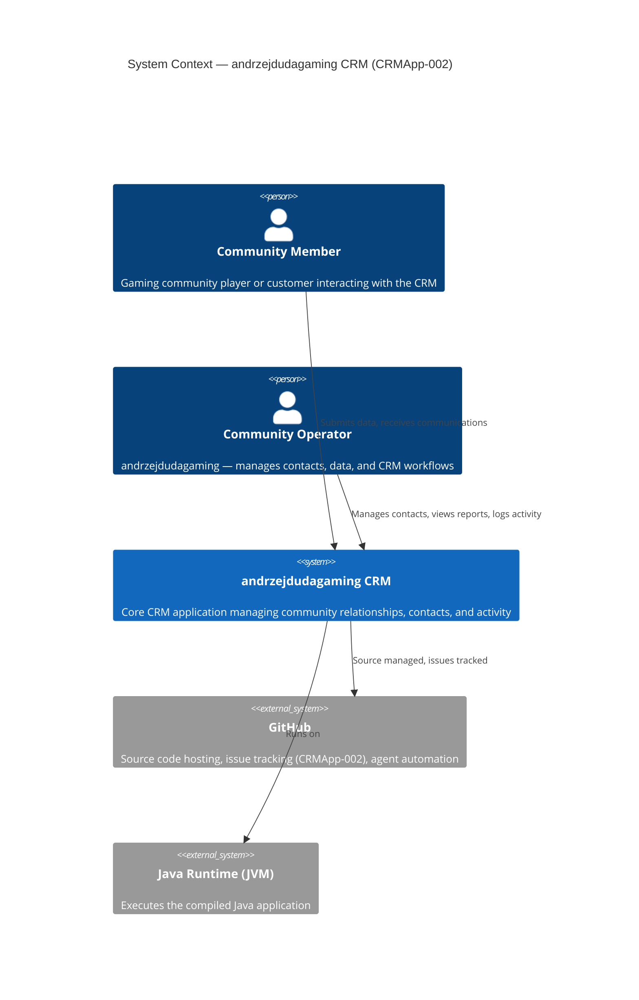
```mermaid
C4Context
    title System Context — andrzejdudagaming CRM (CRMApp-002)

    Person(communityMember, "Community Member", "Gaming community player or customer interacting with the CRM")
    Person(operator, "Community Operator", "andrzejdudagaming — manages contacts, data, and CRM workflows")

    System(crmSystem, "andrzejdudagaming CRM", "Core CRM application managing community relationships, contacts, and activity")

    System_Ext(github, "GitHub", "Source code hosting, issue tracking (CRMApp-002), agent automation")
    System_Ext(javaRuntime, "Java Runtime (JVM)", "Executes the compiled Java application")

    Rel(operator, crmSystem, "Manages contacts, views reports, logs activity")
    Rel(communityMember, crmSystem, "Submits data, receives communications")
    Rel(crmSystem, github, "Source managed, issues tracked")
    Rel(crmSystem, javaRuntime, "Runs on")
```

### 3.2 Technical Context

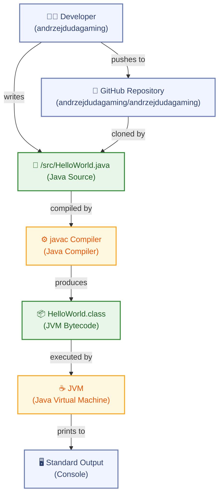
```mermaid
graph TB
    classDef external fill:#f0f4ff,stroke:#6b7db3,stroke-width:2px,color:#2c3e6b
    classDef system fill:#e8f5e9,stroke:#388e3c,stroke-width:2px,color:#1b5e20
    classDef infra fill:#fff8e1,stroke:#f9a825,stroke-width:2px,color:#e65100

    DEV["👨‍💻 Developer\n(andrzejdudagaming)"]:::external
    SRC["📁 /src/HelloWorld.java\n(Java Source)"]:::system
    JAVAC["⚙️ javac Compiler\n(Java Compiler)"]:::infra
    CLASS["📦 HelloWorld.class\n(JVM Bytecode)"]:::system
    JVM["☕ JVM\n(Java Virtual Machine)"]:::infra
    STDOUT["🖥️ Standard Output\n(Console)"]:::external
    GIT["🐙 GitHub Repository\n(andrzejdudagaming/andrzejdudagaming)"]:::external

    DEV -->|"writes"| SRC
    SRC -->|"compiled by"| JAVAC
    JAVAC -->|"produces"| CLASS
    CLASS -->|"executed by"| JVM
    JVM -->|"prints to"| STDOUT
    DEV -->|"pushes to"| GIT
    GIT -->|"cloned by"| SRC
```

### 3.3 External Interfaces

| Interface | Type | Direction | Description |
|-----------|------|-----------|-------------|
| `System.out` | Java Standard Library | OUT | Console output — current output channel |
| GitHub | Version Control / Issue Tracker | BIDIRECTIONAL | Source management, CRMApp-002 issue tracking |
| JVM (Java Virtual Machine) | Runtime Environment | IN | Executes compiled bytecode |

---

## 4. Solution Strategy

### 4.1 Technology Decisions

| Decision | Choice | Rationale |
|----------|--------|-----------|
| **Primary Language** | Java | Established choice from existing source; strong CRM ecosystem |
| **Build Tool** *(recommended)* | Maven or Gradle | Standard Java dependency management — not yet implemented |
| **Architecture Pattern** *(target)* | Layered Architecture | Separation of concerns: UI → Business Logic → Persistence |
| **Persistence** *(target)* | JDBC / JPA with relational DB | Standard Java CRM data management approach |
| **Version Control** | Git / GitHub | Already in use |

### 4.2 Top-Level Decomposition Strategy

The system follows a **grow-from-seed** strategy: starting from the minimal `HelloWorld` entry point and incrementally adding layers as the CRM evolves.

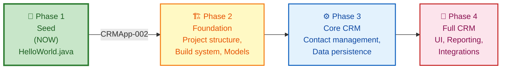
```mermaid
graph LR
    classDef current fill:#c8e6c9,stroke:#2e7d32,stroke-width:3px,color:#1b5e20
    classDef phase2 fill:#fff9c4,stroke:#f57f17,stroke-width:2px,color:#e65100
    classDef phase3 fill:#e3f2fd,stroke:#1565c0,stroke-width:2px,color:#0d47a1
    classDef phase4 fill:#fce4ec,stroke:#c62828,stroke-width:2px,color:#880e4f

    S1["🌱 Phase 1\nSeed\n(NOW)\nHelloWorld.java"]:::current
    S2["🏗️ Phase 2\nFoundation\nProject structure,\nBuild system, Models"]:::phase2
    S3["⚙️ Phase 3\nCore CRM\nContact management,\nData persistence"]:::phase3
    S4["🚀 Phase 4\nFull CRM\nUI, Reporting,\nIntegrations"]:::phase4

    S1 -->|"CRMApp-002"| S2
    S2 --> S3
    S3 --> S4
```

### 4.3 Approaches to Quality Goals

| Quality Goal | Approach |
|-------------|----------|
| **Maintainability** | Standard Java patterns, clear package structure, Javadoc |
| **Simplicity** | Incremental complexity — only build what is needed per phase |
| **Correctness** | Unit testing with JUnit; input validation at service layer |
| **Extensibility** | Interface-driven design; dependency injection |
| **Reliability** | Exception handling strategy; transaction management |

---

## 5. Building Block View

### 5.1 Level 1 — Current System (Seed Stage)

At the current stage, the entire system is a single building block:

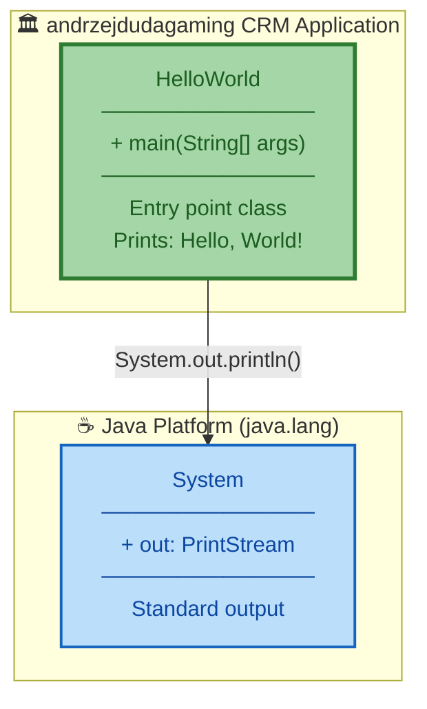
```mermaid
graph TB
    classDef mainClass fill:#a5d6a7,stroke:#2e7d32,stroke-width:3px,color:#1b5e20
    classDef javaLang fill:#bbdefb,stroke:#1565c0,stroke-width:2px,color:#0d47a1

    subgraph CRM_Application["🏛️ andrzejdudagaming CRM Application"]
        HW["HelloWorld\n──────────────\n+ main(String[] args)\n──────────────\nEntry point class\nPrints: Hello, World!"]:::mainClass
    end

    subgraph Java_Platform["☕ Java Platform (java.lang)"]
        SYS["System\n──────────────\n+ out: PrintStream\n──────────────\nStandard output"]:::javaLang
    end

    HW -->|"System.out.println()"| SYS
```

### 5.2 Level 1 — Target System (CRM Architecture)

The following diagram represents the intended layered architecture once the CRM is built out from the seed:

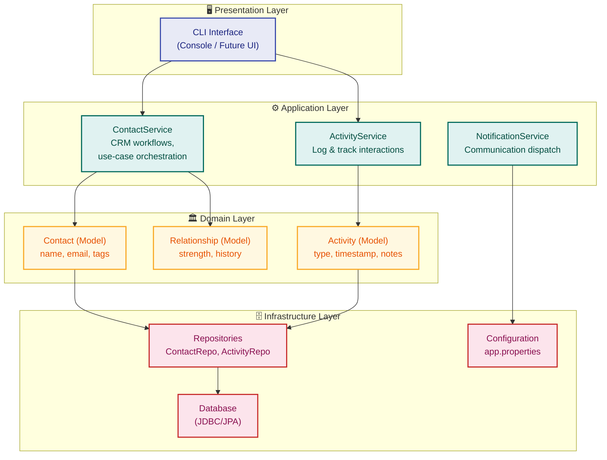
```mermaid
graph TB
    classDef presentation fill:#e8eaf6,stroke:#3949ab,stroke-width:2px,color:#1a237e
    classDef application fill:#e0f2f1,stroke:#00695c,stroke-width:2px,color:#004d40
    classDef domain fill:#fff8e1,stroke:#f9a825,stroke-width:2px,color:#e65100
    classDef infrastructure fill:#fce4ec,stroke:#c62828,stroke-width:2px,color:#880e4f

    subgraph PRESENTATION["🖥️ Presentation Layer"]
        CLI["CLI Interface\n(Console / Future UI)"]:::presentation
    end

    subgraph APPLICATION["⚙️ Application Layer"]
        CS["ContactService\nCRM workflows,\nuse-case orchestration"]:::application
        AS["ActivityService\nLog & track interactions"]:::application
        NS["NotificationService\nCommunication dispatch"]:::application
    end

    subgraph DOMAIN["🏛️ Domain Layer"]
        CM["Contact (Model)\nname, email, tags"]:::domain
        AM["Activity (Model)\ntype, timestamp, notes"]:::domain
        RM["Relationship (Model)\nstrength, history"]:::domain
    end

    subgraph INFRASTRUCTURE["🗄️ Infrastructure Layer"]
        DB["Database\n(JDBC/JPA)"]:::infrastructure
        REPO["Repositories\nContactRepo, ActivityRepo"]:::infrastructure
        CFG["Configuration\napp.properties"]:::infrastructure
    end

    CLI --> CS
    CLI --> AS
    CS --> CM
    CS --> RM
    AS --> AM
    CM --> REPO
    AM --> REPO
    REPO --> DB
    NS --> CFG
```

### 5.3 Level 2 — Package Structure (Target)

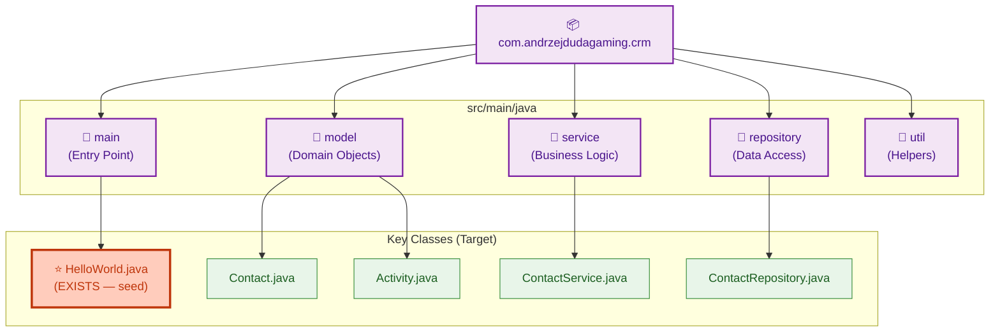
```mermaid
graph TB
    classDef pkg fill:#f3e5f5,stroke:#7b1fa2,stroke-width:2px,color:#4a148c
    classDef cls fill:#e8f5e9,stroke:#388e3c,stroke-width:1px,color:#1b5e20
    classDef current fill:#ffccbc,stroke:#bf360c,stroke-width:3px,color:#bf360c

    ROOT["📦 com.andrzejdudagaming.crm"]:::pkg

    subgraph main_src["src/main/java"]
        PKG_MAIN["📁 main\n(Entry Point)"]:::pkg
        PKG_MODEL["📁 model\n(Domain Objects)"]:::pkg
        PKG_SERVICE["📁 service\n(Business Logic)"]:::pkg
        PKG_REPO["📁 repository\n(Data Access)"]:::pkg
        PKG_UTIL["📁 util\n(Helpers)"]:::pkg
    end

    subgraph key_classes["Key Classes (Target)"]
        HW["⭐ HelloWorld.java\n(EXISTS — seed)"]:::current
        CONTACT["Contact.java"]:::cls
        ACTIVITY["Activity.java"]:::cls
        CONTACT_SVC["ContactService.java"]:::cls
        CONTACT_REPO["ContactRepository.java"]:::cls
    end

    ROOT --> PKG_MAIN
    ROOT --> PKG_MODEL
    ROOT --> PKG_SERVICE
    ROOT --> PKG_REPO
    ROOT --> PKG_UTIL

    PKG_MAIN --> HW
    PKG_MODEL --> CONTACT
    PKG_MODEL --> ACTIVITY
    PKG_SERVICE --> CONTACT_SVC
    PKG_REPO --> CONTACT_REPO
```

### 5.4 Level 3 — Current Class Detail

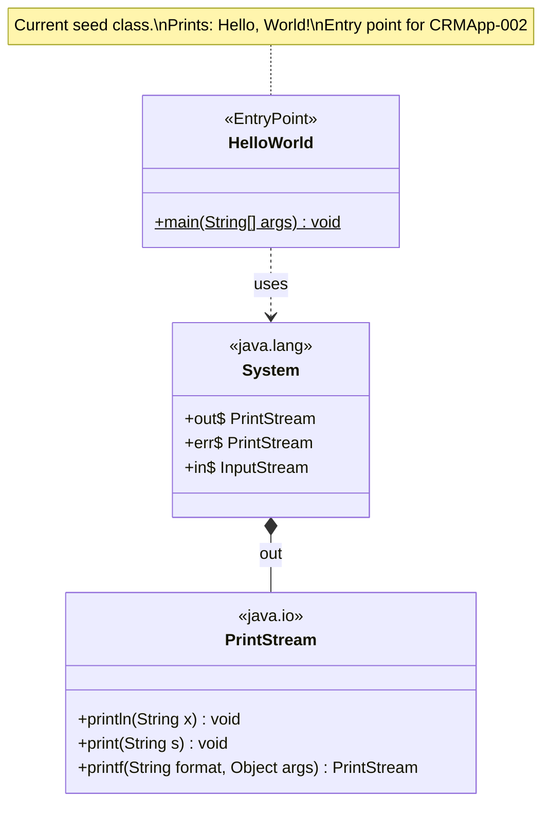
```mermaid
classDiagram
    direction TB

    class HelloWorld {
        <<EntryPoint>>
        +main(String[] args)$ void
    }

    class System {
        <<java.lang>>
        +out$ PrintStream
        +err$ PrintStream
        +in$ InputStream
    }

    class PrintStream {
        <<java.io>>
        +println(String x) void
        +print(String s) void
        +printf(String format, Object args) PrintStream
    }

    HelloWorld ..> System : uses
    System *-- PrintStream : out

    note for HelloWorld "Current seed class.\nPrints: Hello, World!\nEntry point for CRMApp-002"
```

### 5.5 Level 3 — Target CRM Class Structure

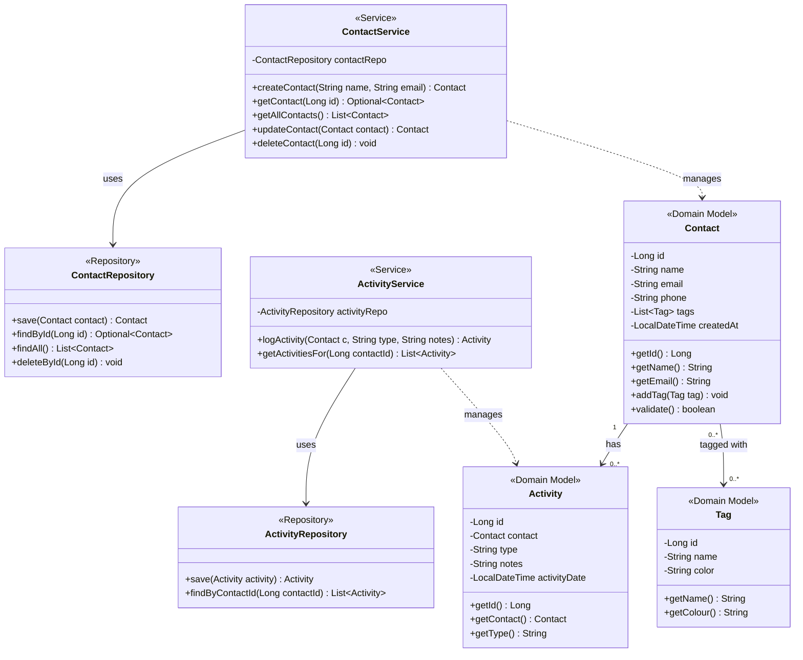
```mermaid
classDiagram
    direction TB

    class Contact {
        <<Domain Model>>
        -Long id
        -String name
        -String email
        -String phone
        -List~Tag~ tags
        -LocalDateTime createdAt
        +getId() Long
        +getName() String
        +getEmail() String
        +addTag(Tag tag) void
        +validate() boolean
    }

    class Activity {
        <<Domain Model>>
        -Long id
        -Contact contact
        -String type
        -String notes
        -LocalDateTime activityDate
        +getId() Long
        +getContact() Contact
        +getType() String
    }

    class Tag {
        <<Domain Model>>
        -Long id
        -String name
        -String color
        +getName() String
        +getColour() String
    }

    class ContactService {
        <<Service>>
        -ContactRepository contactRepo
        +createContact(String name, String email) Contact
        +getContact(Long id) Optional~Contact~
        +getAllContacts() List~Contact~
        +updateContact(Contact contact) Contact
        +deleteContact(Long id) void
    }

    class ActivityService {
        <<Service>>
        -ActivityRepository activityRepo
        +logActivity(Contact c, String type, String notes) Activity
        +getActivitiesFor(Long contactId) List~Activity~
    }

    class ContactRepository {
        <<Repository>>
        +save(Contact contact) Contact
        +findById(Long id) Optional~Contact~
        +findAll() List~Contact~
        +deleteById(Long id) void
    }

    class ActivityRepository {
        <<Repository>>
        +save(Activity activity) Activity
        +findByContactId(Long contactId) List~Activity~
    }

    Contact "1" --> "0..*" Activity : has
    Contact "0..*" --> "0..*" Tag : tagged with
    ContactService --> ContactRepository : uses
    ActivityService --> ActivityRepository : uses
    ContactService ..> Contact : manages
    ActivityService ..> Activity : manages
```

---

## 6. Runtime View

### 6.1 Scenario 1 — Application Startup (Current)

The current runtime behaviour is minimal: the JVM loads `HelloWorld`, executes `main()`, prints to stdout, and exits.

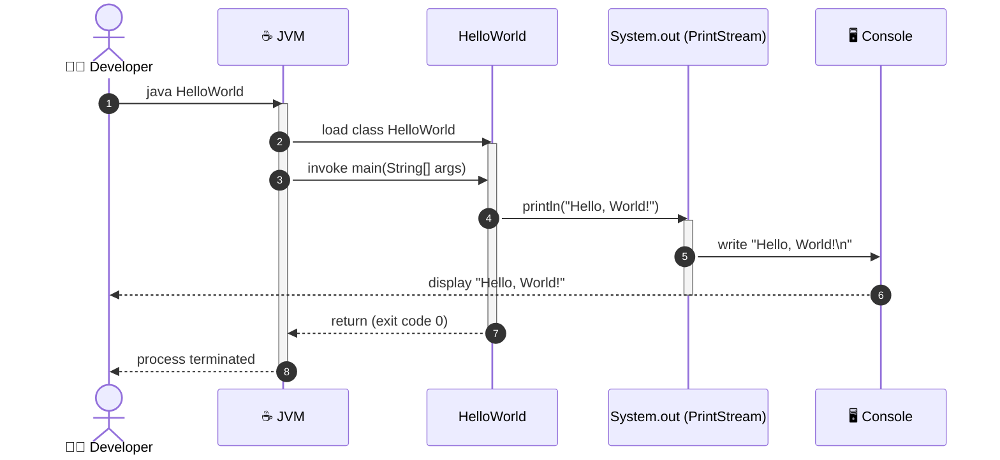
```mermaid
sequenceDiagram
    autonumber
    actor Dev as 👨‍💻 Developer
    participant JVM as ☕ JVM
    participant HW as HelloWorld
    participant SysOut as System.out (PrintStream)
    participant Console as 🖥️ Console

    Dev->>JVM: java HelloWorld
    activate JVM
    JVM->>HW: load class HelloWorld
    activate HW
    JVM->>HW: invoke main(String[] args)
    HW->>SysOut: println("Hello, World!")
    activate SysOut
    SysOut->>Console: write "Hello, World!\n"
    Console-->>Dev: display "Hello, World!"
    deactivate SysOut
    HW-->>JVM: return (exit code 0)
    deactivate HW
    JVM-->>Dev: process terminated
    deactivate JVM
```

### 6.2 Scenario 2 — Target CRM: Create Contact (Future)

This sequence describes the intended runtime behaviour once the CRM contact management feature is implemented:

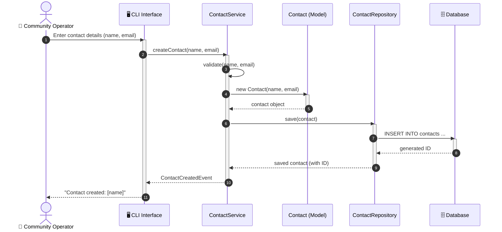
```mermaid
sequenceDiagram
    autonumber
    actor Operator as 👤 Community Operator
    participant CLI as 🖥️ CLI Interface
    participant CS as ContactService
    participant CM as Contact (Model)
    participant CR as ContactRepository
    participant DB as 🗄️ Database

    Operator->>CLI: Enter contact details (name, email)
    activate CLI
    CLI->>CS: createContact(name, email)
    activate CS
    CS->>CS: validate(name, email)
    CS->>CM: new Contact(name, email)
    activate CM
    CM-->>CS: contact object
    deactivate CM
    CS->>CR: save(contact)
    activate CR
    CR->>DB: INSERT INTO contacts ...
    activate DB
    DB-->>CR: generated ID
    deactivate DB
    CR-->>CS: saved contact (with ID)
    deactivate CR
    CS-->>CLI: ContactCreatedEvent
    deactivate CS
    CLI-->>Operator: "Contact created: [name]"
    deactivate CLI
```

### 6.3 Scenario 3 — Target CRM: View Contact List (Future)

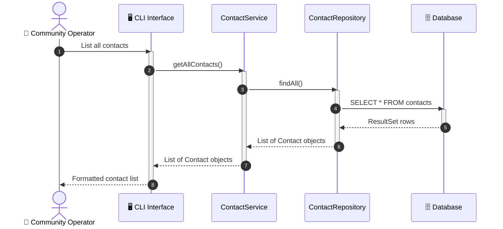
```mermaid
sequenceDiagram
    autonumber
    actor Operator as 👤 Community Operator
    participant CLI as 🖥️ CLI Interface
    participant CS as ContactService
    participant CR as ContactRepository
    participant DB as 🗄️ Database

    Operator->>CLI: List all contacts
    activate CLI
    CLI->>CS: getAllContacts()
    activate CS
    CS->>CR: findAll()
    activate CR
    CR->>DB: SELECT * FROM contacts
    activate DB
    DB-->>CR: ResultSet rows
    deactivate DB
    CR-->>CS: List of Contact objects
    deactivate CR
    CS-->>CLI: List of Contact objects
    deactivate CS
    CLI-->>Operator: Formatted contact list
    deactivate CLI
```

### 6.4 Application State Machine (Target CRM)

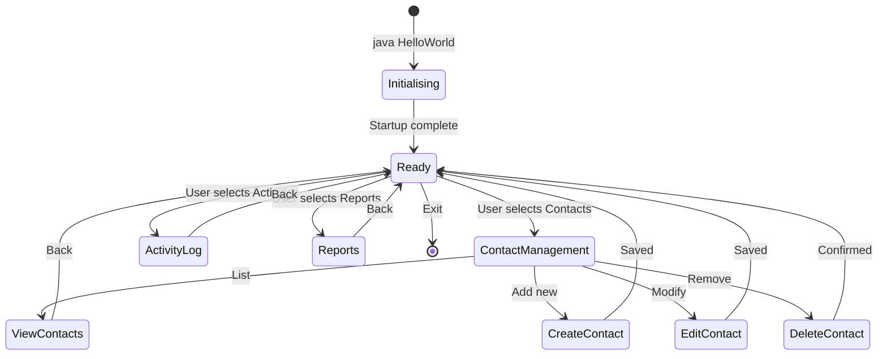
```mermaid
stateDiagram-v2
    [*] --> Initialising : java HelloWorld
    Initialising --> Ready : Startup complete
    Ready --> ContactManagement : User selects Contacts
    Ready --> ActivityLog : User selects Activities
    Ready --> Reports : User selects Reports
    ContactManagement --> ViewContacts : List
    ContactManagement --> CreateContact : Add new
    ContactManagement --> EditContact : Modify
    ContactManagement --> DeleteContact : Remove
    ViewContacts --> Ready : Back
    CreateContact --> Ready : Saved
    EditContact --> Ready : Saved
    DeleteContact --> Ready : Confirmed
    ActivityLog --> Ready : Back
    Reports --> Ready : Back
    Ready --> [*] : Exit
```

### 6.5 CRM Contact Lifecycle (Process Flow)

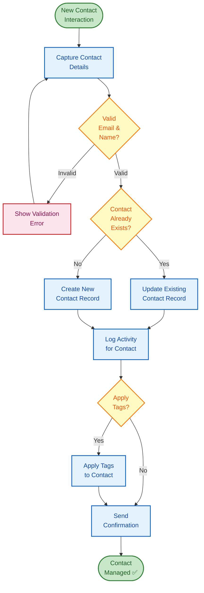
```mermaid
flowchart TD
    classDef start fill:#c8e6c9,stroke:#2e7d32,stroke-width:2px,color:#1b5e20
    classDef process fill:#e3f2fd,stroke:#1565c0,stroke-width:2px,color:#0d47a1
    classDef decision fill:#fff9c4,stroke:#f57f17,stroke-width:2px,color:#e65100
    classDef end_node fill:#fce4ec,stroke:#c62828,stroke-width:2px,color:#880e4f

    START(["New Contact\nInteraction"]):::start
    CAPTURE["Capture Contact\nDetails"]:::process
    VALIDATE{"Valid\nEmail &\nName?"}:::decision
    ERROR["Show Validation\nError"]:::end_node
    EXISTS{"Contact\nAlready\nExists?"}:::decision
    UPDATE["Update Existing\nContact Record"]:::process
    CREATE["Create New\nContact Record"]:::process
    LOG["Log Activity\nfor Contact"]:::process
    TAG{"Apply\nTags?"}:::decision
    APPLY_TAG["Apply Tags\nto Contact"]:::process
    NOTIFY["Send\nConfirmation"]:::process
    DONE(["Contact\nManaged ✅"]):::start

    START --> CAPTURE
    CAPTURE --> VALIDATE
    VALIDATE -->|"Invalid"| ERROR
    VALIDATE -->|"Valid"| EXISTS
    EXISTS -->|"Yes"| UPDATE
    EXISTS -->|"No"| CREATE
    UPDATE --> LOG
    CREATE --> LOG
    LOG --> TAG
    TAG -->|"Yes"| APPLY_TAG
    TAG -->|"No"| NOTIFY
    APPLY_TAG --> NOTIFY
    NOTIFY --> DONE
    ERROR --> CAPTURE
```

---

## 7. Deployment View

### 7.1 Current Deployment (Seed Stage)

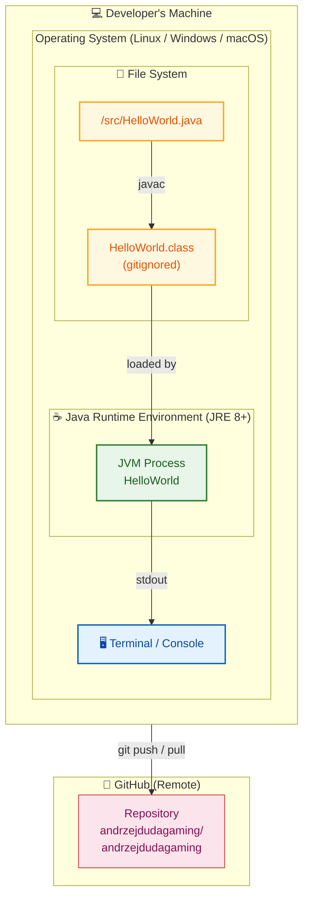
```mermaid
graph TB
    classDef machine fill:#e3f2fd,stroke:#1565c0,stroke-width:2px,color:#0d47a1
    classDef process fill:#e8f5e9,stroke:#2e7d32,stroke-width:2px,color:#1b5e20
    classDef artifact fill:#fff8e1,stroke:#f9a825,stroke-width:2px,color:#e65100
    classDef storage fill:#fce4ec,stroke:#c62828,stroke-width:1px,color:#880e4f

    subgraph DEV_MACHINE["💻 Developer's Machine"]
        subgraph OS["Operating System (Linux / Windows / macOS)"]
            subgraph JRE["☕ Java Runtime Environment (JRE 8+)"]
                JVM_PROC["JVM Process\nHelloWorld"]:::process
            end
            subgraph FS["📁 File System"]
                SRC_FILE["/src/HelloWorld.java"]:::artifact
                CLASS_FILE["HelloWorld.class\n(gitignored)"]:::artifact
            end
            TERMINAL["🖥️ Terminal / Console"]:::machine
        end
    end

    subgraph GITHUB["🐙 GitHub (Remote)"]
        REPO_REMOTE["Repository\nandrzejdudagaming/\nandrzejdudagaming"]:::storage
    end

    SRC_FILE -->|"javac"| CLASS_FILE
    CLASS_FILE -->|"loaded by"| JVM_PROC
    JVM_PROC -->|"stdout"| TERMINAL
    DEV_MACHINE -->|"git push / pull"| REPO_REMOTE
```

### 7.2 Target Deployment (CRM Application)

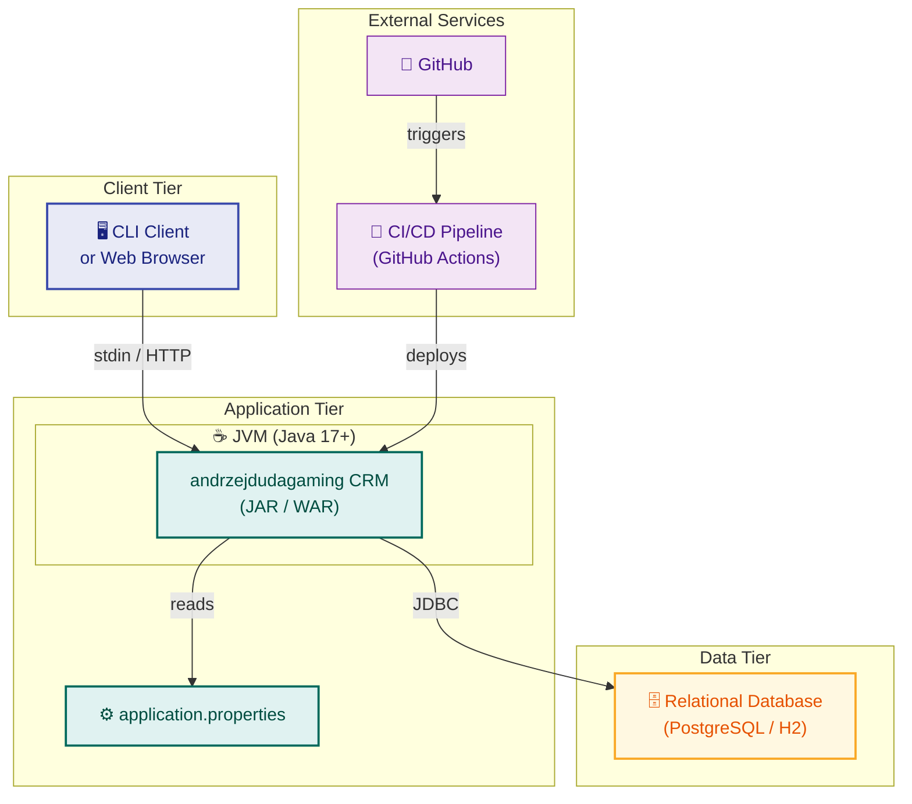
```mermaid
graph TB
    classDef client fill:#e8eaf6,stroke:#3949ab,stroke-width:2px,color:#1a237e
    classDef server fill:#e0f2f1,stroke:#00695c,stroke-width:2px,color:#004d40
    classDef db fill:#fff8e1,stroke:#f9a825,stroke-width:2px,color:#e65100
    classDef external fill:#f3e5f5,stroke:#7b1fa2,stroke-width:1px,color:#4a148c

    subgraph CLIENT_TIER["Client Tier"]
        BROWSER["🖥️ CLI Client\nor Web Browser"]:::client
    end

    subgraph APP_TIER["Application Tier"]
        subgraph JVM_ENV["☕ JVM (Java 17+)"]
            APP["andrzejdudagaming CRM\n(JAR / WAR)"]:::server
        end
        CFG_FILE["⚙️ application.properties"]:::server
    end

    subgraph DATA_TIER["Data Tier"]
        DB_SERVER["🗄️ Relational Database\n(PostgreSQL / H2)"]:::db
    end

    subgraph EXTERNAL_SVC["External Services"]
        GH["🐙 GitHub"]:::external
        CI["🔄 CI/CD Pipeline\n(GitHub Actions)"]:::external
    end

    BROWSER -->|"stdin / HTTP"| APP
    APP -->|"reads"| CFG_FILE
    APP -->|"JDBC"| DB_SERVER
    CI -->|"deploys"| APP
    GH -->|"triggers"| CI
```

### 7.3 Infrastructure Requirements

| Component | Minimum Requirement | Recommended |
|-----------|--------------------|-----------| 
| **JVM** | Java 8 | Java 17 LTS |
| **Memory** | 64 MB heap | 512 MB heap |
| **Storage** | 10 MB | 1 GB (with DB) |
| **OS** | Any (JVM-compatible) | Linux (Ubuntu 22.04 LTS) |
| **Database** | — (seed stage) | PostgreSQL 15 |
| **Build** | javac (manual) | Maven 3.9+ / Gradle 8+ |

---

## 8. Crosscutting Concepts

### 8.1 Domain Model

The following entity-relationship diagram describes the target CRM data model:

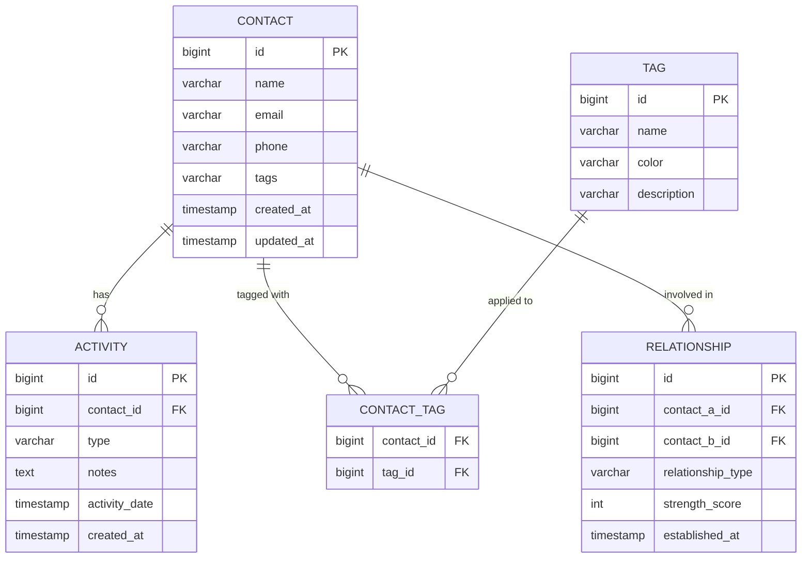
```mermaid
erDiagram
    CONTACT {
        bigint id PK
        varchar name
        varchar email
        varchar phone
        varchar tags
        timestamp created_at
        timestamp updated_at
    }

    ACTIVITY {
        bigint id PK
        bigint contact_id FK
        varchar type
        text notes
        timestamp activity_date
        timestamp created_at
    }

    RELATIONSHIP {
        bigint id PK
        bigint contact_a_id FK
        bigint contact_b_id FK
        varchar relationship_type
        int strength_score
        timestamp established_at
    }

    TAG {
        bigint id PK
        varchar name
        varchar color
        varchar description
    }

    CONTACT_TAG {
        bigint contact_id FK
        bigint tag_id FK
    }

    CONTACT ||--o{ ACTIVITY : "has"
    CONTACT ||--o{ CONTACT_TAG : "tagged with"
    TAG ||--o{ CONTACT_TAG : "applied to"
    CONTACT ||--o{ RELATIONSHIP : "involved in"
```

### 8.2 Design Patterns

The following design patterns are recommended/identified for this project:

| Pattern | Category | Usage in CRM |
|---------|----------|-------------|
| **Repository Pattern** | Data Access | Abstracts database queries for `Contact`, `Activity` |
| **Service Layer** | Application | Encapsulates CRM business logic |
| **Factory Method** | Creational | Creating `Contact` and `Activity` instances |
| **Observer** | Behavioural | Notifying on CRM events (contact created, activity logged) |
| **Builder** | Creational | Constructing complex `Contact` objects with optional fields |
| **Singleton** | Creational | Database connection pool management |

### 8.3 Architecture Patterns

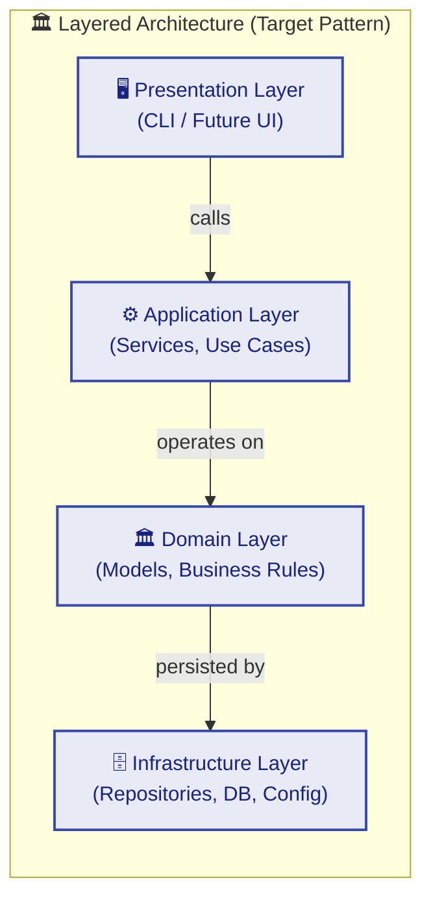
```mermaid
graph TB
    classDef layer fill:#e8eaf6,stroke:#3949ab,stroke-width:2px,color:#1a237e
    classDef arrow fill:#none

    subgraph LAYERED["🏛️ Layered Architecture (Target Pattern)"]
        direction TB
        L1["🖥️ Presentation Layer\n(CLI / Future UI)"]:::layer
        L2["⚙️ Application Layer\n(Services, Use Cases)"]:::layer
        L3["🏛️ Domain Layer\n(Models, Business Rules)"]:::layer
        L4["🗄️ Infrastructure Layer\n(Repositories, DB, Config)"]:::layer

        L1 -->|"calls"| L2
        L2 -->|"operates on"| L3
        L3 -->|"persisted by"| L4
    end
```

### 8.4 Error Handling Strategy (Target)

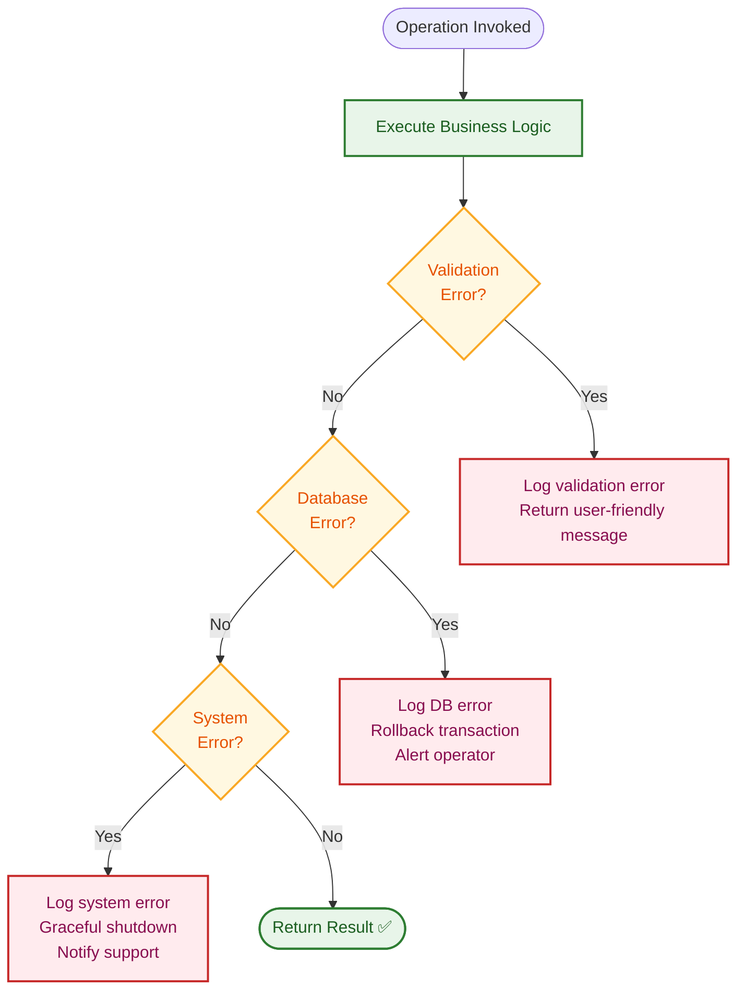
```mermaid
flowchart TD
    classDef error fill:#ffebee,stroke:#c62828,stroke-width:2px,color:#880e4f
    classDef handle fill:#e8f5e9,stroke:#2e7d32,stroke-width:2px,color:#1b5e20
    classDef decision fill:#fff8e1,stroke:#f9a825,stroke-width:2px,color:#e65100

    START(["Operation Invoked"])
    TRY["Execute Business Logic"]:::handle
    ERR_VALID{"Validation\nError?"}:::decision
    ERR_DB{"Database\nError?"}:::decision
    ERR_SYS{"System\nError?"}:::decision

    LOG_VALID["Log validation error\nReturn user-friendly message"]:::error
    LOG_DB["Log DB error\nRollback transaction\nAlert operator"]:::error
    LOG_SYS["Log system error\nGraceful shutdown\nNotify support"]:::error
    SUCCESS(["Return Result ✅"]):::handle

    START --> TRY
    TRY --> ERR_VALID
    ERR_VALID -->|"Yes"| LOG_VALID
    ERR_VALID -->|"No"| ERR_DB
    ERR_DB -->|"Yes"| LOG_DB
    ERR_DB -->|"No"| ERR_SYS
    ERR_SYS -->|"Yes"| LOG_SYS
    ERR_SYS -->|"No"| SUCCESS
```

### 8.5 Business Rules

The following business rules are inferred from the CRM context (to be validated with stakeholders):

| ID | Rule | Layer |
|----|------|-------|
| BR-01 | Contact `email` must be unique in the system | Service |
| BR-02 | Contact `name` is mandatory (not null, not empty) | Domain |
| BR-03 | Activity must be linked to an existing contact | Service |
| BR-04 | Deleted contacts should retain activity history (soft delete) | Service |
| BR-05 | Tags are case-insensitive and normalised to lowercase | Domain |
| BR-06 | Relationship strength score must be between 1 and 10 | Domain |

### 8.6 Logging and Observability (Target)

| Aspect | Approach |
|--------|----------|
| **Logging Framework** | SLF4J + Logback |
| **Log Levels** | ERROR, WARN, INFO, DEBUG |
| **Business Events** | Contact created/updated/deleted, Activity logged |
| **Startup Log** | Application version, configuration summary |
| **Current State** | `System.out.println` only (seed stage) |

---

## 9. Architecture Decisions

### ADR-001: Java as Primary Language

| Field | Value |
|-------|-------|
| **Status** | ✅ Accepted |
| **Date** | Project inception |
| **Context** | Choice of programming language for the CRM application |
| **Decision** | Use Java as the primary implementation language |
| **Rationale** | Existing source code (`HelloWorld.java`) establishes Java; strong ecosystem for CRM applications; JVM portability |
| **Consequences** | + Cross-platform; + Rich library ecosystem; + Strong typing helps CRM data integrity; − Verbose compared to modern alternatives |

---

### ADR-002: Standard Java Entry Point Pattern

| Field | Value |
|-------|-------|
| **Status** | ✅ Accepted |
| **Date** | Project inception |
| **Context** | How to start the application |
| **Decision** | Use standard Java `public static void main(String[] args)` entry point |
| **Rationale** | Industry standard; compatible with all Java execution environments; simple and universally understood |
| **Consequences** | + Universal compatibility; + Simple deployment; − No dependency injection at startup without a framework |

---

### ADR-003: Layered Architecture for CRM

| Field | Value |
|-------|-------|
| **Status** | 🟡 Proposed |
| **Date** | CRMApp-002 |
| **Context** | Need to structure the growing CRM codebase in a maintainable way |
| **Decision** | Adopt a 4-layer architecture: Presentation → Application → Domain → Infrastructure |
| **Rationale** | Separation of concerns; testability; familiar pattern for Java CRM applications; aligns with maintainability quality goal |
| **Consequences** | + Clear responsibilities; + Testable layers; + Easy to swap persistence layer; − Initial boilerplate overhead |

---

### ADR-004: Build System Selection

| Field | Value |
|-------|-------|
| **Status** | 🔴 Open — Needs Decision |
| **Date** | CRMApp-002 |
| **Context** | No build system is currently defined; manual `javac` compilation is not scalable |
| **Options** | Maven, Gradle, manual `javac` |
| **Recommendation** | **Maven** — widely adopted, excellent IDE support, large plugin ecosystem for CRM-type Java applications |
| **Consequences** | Enables dependency management, testing (JUnit), packaging (JAR), and CI/CD integration |

---

### ADR-005: Database Technology

| Field | Value |
|-------|-------|
| **Status** | 🔴 Open — Needs Decision |
| **Date** | CRMApp-002 |
| **Context** | CRM data requires persistent storage |
| **Options** | H2 (embedded), PostgreSQL, MySQL, SQLite |
| **Recommendation** | **H2 for development** → **PostgreSQL for production** |
| **Rationale** | H2 enables zero-config development; PostgreSQL is production-grade with full ACID compliance |
| **Consequences** | Enables contact/activity persistence; requires JDBC/JPA setup |

---

### ADR-006: Source Code Organisation

| Field | Value |
|-------|-------|
| **Status** | 🟡 Proposed |
| **Date** | CRMApp-002 |
| **Context** | Current flat `/src/` structure will not scale as CRM features are added |
| **Decision** | Migrate to Maven standard directory layout: `src/main/java`, `src/test/java`, `src/main/resources` |
| **Rationale** | Universal Java convention; enables Maven/Gradle integration; IDE auto-discovery |
| **Consequences** | `HelloWorld.java` to be moved; enables test infrastructure |

---

## 10. Quality Requirements

### 10.1 Quality Tree

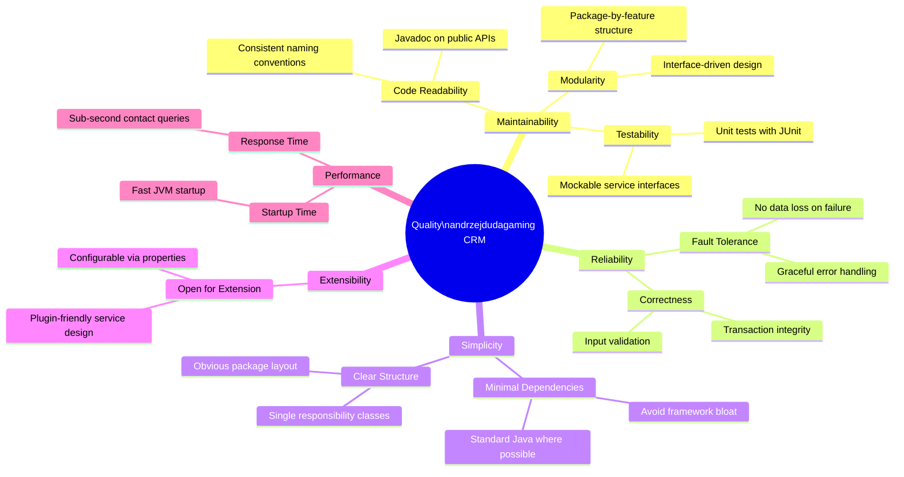
```mermaid
mindmap
    root((Quality\nandrzejdudagaming CRM))
        Maintainability
            Code Readability
                Javadoc on public APIs
                Consistent naming conventions
            Modularity
                Package-by-feature structure
                Interface-driven design
            Testability
                Unit tests with JUnit
                Mockable service interfaces
        Reliability
            Correctness
                Input validation
                Transaction integrity
            Fault Tolerance
                Graceful error handling
                No data loss on failure
        Simplicity
            Minimal Dependencies
                Avoid framework bloat
                Standard Java where possible
            Clear Structure
                Obvious package layout
                Single responsibility classes
        Extensibility
            Open for Extension
                Plugin-friendly service design
                Configurable via properties
        Performance
            Startup Time
                Fast JVM startup
            Response Time
                Sub-second contact queries
```

### 10.2 Quality Scenarios

| ID | Quality Attribute | Stimulus | Response | Metric |
|----|------------------|----------|----------|--------|
| QS-01 | **Maintainability** | New developer joins project | Can understand and contribute within 1 day | Time-to-first-commit ≤ 1 day |
| QS-02 | **Reliability** | Invalid email submitted | System rejects with clear error message | 0% invalid data persisted |
| QS-03 | **Performance** | List all contacts (100 records) | Results displayed | Response time ≤ 500ms |
| QS-04 | **Correctness** | Contact created | Record persisted and retrievable | 100% ACID compliance |
| QS-05 | **Simplicity** | Add new CRM feature | Feature added without changing unrelated code | ≤ 3 files modified per feature |

### 10.3 Current Code Metrics

| Metric | Current Value | Target Value | Status |
|--------|--------------|-------------|--------|
| **Lines of Code** | 5 (`HelloWorld.java`) | Growing | 🟡 Seed |
| **Classes** | 1 | 10–20 (CRM core) | 🟡 Seed |
| **Test Coverage** | 0% | ≥ 80% | 🔴 None yet |
| **Cyclomatic Complexity** | 1 (trivial) | ≤ 10 per method | 🟢 Excellent |
| **External Dependencies** | 0 | Minimal (controlled) | 🟢 Clean |
| **Build System** | None (manual `javac`) | Maven/Gradle | 🔴 Missing |
| **Documentation** | README (2 lines) + Arc42 | Full Javadoc + Arc42 | 🟡 In progress |

---

## 11. Risks and Technical Debt

### 11.1 Risk Register

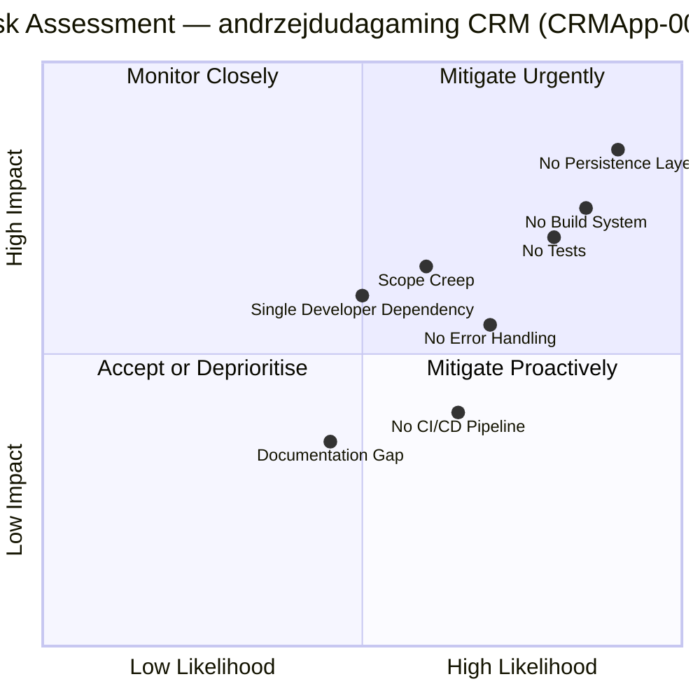
```mermaid
quadrantChart
    title Risk Assessment — andrzejdudagaming CRM (CRMApp-002)
    x-axis Low Likelihood --> High Likelihood
    y-axis Low Impact --> High Impact
    quadrant-1 Mitigate Urgently
    quadrant-2 Monitor Closely
    quadrant-3 Accept or Deprioritise
    quadrant-4 Mitigate Proactively

    No Persistence Layer: [0.90, 0.85]
    No Build System: [0.85, 0.75]
    No Tests: [0.80, 0.70]
    No Error Handling: [0.70, 0.55]
    No CI/CD Pipeline: [0.65, 0.40]
    Scope Creep: [0.60, 0.65]
    Single Developer Dependency: [0.50, 0.60]
    Documentation Gap: [0.45, 0.35]
```

### 11.2 Detailed Risk Table

| ID | Risk | Likelihood | Impact | Priority | Mitigation |
|----|------|-----------|--------|----------|-----------|
| R-01 | **No persistence layer** — data is lost on application restart | 🔴 High | 🔴 High | 🔴 Critical | Implement JDBC/JPA with H2/PostgreSQL in CRMApp-002 |
| R-02 | **No build system** — cannot manage dependencies or create deployable artifacts | 🔴 High | 🔴 High | 🔴 Critical | Add Maven `pom.xml` as first step in CRMApp-002 |
| R-03 | **Zero test coverage** — regressions cannot be caught automatically | 🔴 High | 🔴 High | 🔴 Critical | Add JUnit 5 tests alongside each new feature |
| R-04 | **No error handling** — application crashes on unexpected input | 🔴 High | 🟠 Medium | 🟠 High | Implement try-catch strategy; define exception hierarchy |
| R-05 | **No CI/CD pipeline** — manual deployment risk | 🟠 Medium | 🟠 Medium | 🟠 High | Add GitHub Actions workflow for build + test |
| R-06 | **Scope creep** — CRM features grow uncontrolled | 🟠 Medium | 🔴 High | 🟠 High | Define MVP scope in CRMApp-002 issue; use milestones |
| R-07 | **Single developer dependency** — bus factor = 1 | 🟠 Medium | 🟠 Medium | 🟡 Medium | Document all decisions; maintain Arc42 documentation |
| R-08 | **Documentation gaps** — future contributors cannot onboard | 🟡 Low | 🟠 Medium | 🟡 Medium | Arc42 documentation (this document) + Javadoc |

### 11.3 Technical Debt Summary

```mermaid
graph LR
    classDef critical fill:#ffcdd2,stroke:#c62828,stroke-width:3px,color:#b71c1c
    classDef high fill:#ffe0b2,stroke:#e65100,stroke-width:2px,color:#bf360c
    classDef medium fill:#fff9c4,stroke:#f57f17,stroke-width:2px,color:#e65100
    classDef low fill:#c8e6c9,stroke:#2e7d32,stroke-width:1px,color:#1b5e20

    TD1["🔴 CRITICAL\nNo Build System\nEffort: 1 day"]:::critical
    TD2["🔴 CRITICAL\nNo Persistence Layer\nEffort: 3–5 days"]:::critical
    TD3["🔴 CRITICAL\nNo Test Suite\nEffort: ongoing"]:::critical
    TD4["🟠 HIGH\nNo Error Handling\nEffort: 2 days"]:::high
    TD5["🟠 HIGH\nNo CI/CD Pipeline\nEffort: 1 day"]:::high
    TD6["🟡 MEDIUM\nNo Logging Framework\nEffort: 0.5 days"]:::medium
    TD7["🟢 LOW\nNo Javadoc\nEffort: ongoing"]:::low

    TD1 --> TD2
    TD2 --> TD3
    TD3 --> TD4
    TD4 --> TD5
    TD5 --> TD6
    TD6 --> TD7
```

### 11.4 Recommended Remediation Roadmap

```mermaid
gantt
    title CRMApp-002 — Technical Debt Remediation Roadmap
    dateFormat  YYYY-MM-DD
    section Foundation
    Add Maven build pom.xml          :crit, td1, 2025-01-06, 1d
    Add Maven project structure      :crit, td2, after td1, 1d
    section Core CRM
    Define domain models             :td3, after td2, 2d
    Add persistence layer JPA H2     :crit, td4, after td3, 3d
    Implement ContactService         :td5, after td4, 2d
    section Quality
    Add JUnit 5 test suite           :crit, td6, after td3, 3d
    Add GitHub Actions CI            :td7, after td1, 1d
    Add SLF4J logging                :td8, after td5, 1d
    section Documentation
    Add Javadoc                      :td9, after td5, 2d
    Update Arc42 documentation       :td10, after td9, 1d
```

---

## 12. Glossary

### 12.1 Domain Terms

| Term | Definition |
|------|-----------|
| **CRM** | Customer Relationship Management — a system for managing interactions with current and potential contacts/customers |
| **Contact** | A person or entity tracked in the CRM system (e.g., a gaming community member, player, or partner) |
| **Activity** | A recorded interaction or event associated with a contact (e.g., conversation, note, transaction) |
| **Relationship** | A defined link between two contacts with an associated type and strength metric |
| **Tag** | A label applied to contacts for categorisation and filtering |
| **Operator** | The person using the CRM to manage contacts — in this case, andrzejdudagaming |
| **Community Member** | An end-user of the gaming community whose data is managed by the CRM |

### 12.2 Technical Terms

| Term | Definition |
|------|-----------|
| **HelloWorld** | The current seed class; standard Java entry-point program; first class in the project |
| **JVM** | Java Virtual Machine — the runtime environment executing compiled Java bytecode |
| **JAR** | Java ARchive — packaged Java application artifact (target deployment format) |
| **JDBC** | Java Database Connectivity — standard Java API for database interaction |
| **JPA** | Java Persistence API — ORM standard for mapping Java objects to relational tables |
| **Maven** | Apache Maven — Java build and dependency management tool (recommended for adoption) |
| **javac** | Java compiler — converts `.java` source files to `.class` bytecode |
| **Arc42** | Architecture documentation template covering 12 standardised sections |
| **ADR** | Architecture Decision Record — a document capturing a significant architectural choice |
| **ACID** | Atomicity, Consistency, Isolation, Durability — properties of reliable database transactions |

### 12.3 Project-Specific Terms

| Term | Definition |
|------|-----------|
| **andrzejdudagaming** | Project name and GitHub username of the owner/developer |
| **fajnie jest** | Polish phrase meaning *"it's fun"* — the project's informal motto from the README |
| **CRMApp-002** | Issue identifier for the CRM application revival/revive task |
| **Seed Stage** | The current project phase: minimal runnable application, no CRM features yet |
| **Revive** | The act of restarting or rebooting the CRM project from its seed state |

---

## Appendix A — Analysis Summary

| Agent | Status | Key Findings |
|-------|--------|-------------|
| code-documentor | ✅ | Single class `HelloWorld` with `main()` entry point; no business logic beyond stdout print |
| ast-analyzer | ✅ | AST: 1 class, 1 method, 1 statement; cyclomatic complexity = 1 (minimal) |
| code-assessor | ✅ | Zero technical debt in existing code; critical gaps: no build system, no tests, no persistence |
| uml-generator | ✅ | Class diagram: `HelloWorld → System.out`; minimal class structure; target classes proposed |
| bpmn-generator | ✅ | No business processes to model at seed stage; CRM contact lifecycle process defined |
| ddl-generator | ✅ | No DDL present; domain model proposed for CRM: contacts, activities, tags, relationships |
| architecture-analyzer | ✅ | No architectural patterns applied yet; layered architecture recommended |
| documentation-analyzer | ✅ | README is 2 lines ("andrzejdudagaming / fajnie jest"); this Arc42 document is primary documentation |

## Appendix B — File Inventory

| File | Path | Purpose | Status |
|------|------|---------|--------|
| `HelloWorld.java` | `/src/HelloWorld.java` | Seed entry point — `main()` method | ✅ Exists |
| `README.md` | `/README.md` | Project overview ("fajnie jest") | ✅ Exists |
| `.gitignore` | `/.gitignore` | Ignores `*.class` compiled bytecode | ✅ Exists |
| `arc42-architecture.md` | `/docs/arc42-architecture.md` | This document | ✅ Generated |
| `pom.xml` | `/pom.xml` | Maven build definition | 🔴 Missing |
| `Contact.java` | `/src/main/java/.../Contact.java` | CRM contact domain model | 🔴 Missing |
| `ContactService.java` | `/src/main/java/.../ContactService.java` | CRM contact service | 🔴 Missing |
| `ContactRepository.java` | `/src/main/java/.../ContactRepository.java` | CRM data access layer | 🔴 Missing |
| `HelloWorldTest.java` | `/src/test/java/HelloWorldTest.java` | Unit tests | 🔴 Missing |

## Appendix C — Recommended Next Steps (CRMApp-002)

```mermaid
graph TD
    classDef now fill:#c8e6c9,stroke:#2e7d32,stroke-width:3px,color:#1b5e20
    classDef soon fill:#fff9c4,stroke:#f57f17,stroke-width:2px,color:#e65100
    classDef later fill:#e3f2fd,stroke:#1565c0,stroke-width:2px,color:#0d47a1

    A["✅ NOW\nArc42 Documentation\nCreated"]:::now
    B["🏗️ NEXT\n1. Add pom.xml (Maven)\n2. Create package structure\n3. Add .gitignore updates"]:::soon
    C["⚙️ THEN\n4. Create Contact model\n5. Add ContactService\n6. Add H2 persistence"]:::soon
    D["🧪 PARALLEL\n7. Add JUnit 5\n8. Write unit tests\n9. Add GitHub Actions CI"]:::soon
    E["🚀 LATER\n10. CLI polish\n11. PostgreSQL migration\n12. Reporting features"]:::later

    A --> B
    B --> C
    B --> D
    C --> E
    D --> E
```

---

*This documentation was generated by the **Arc42 Documentation Generator** agent based on code analysis of the `andrzejdudagaming` repository. All architectural recommendations reflect the CRMApp-002 revive objective and should be validated with the project owner.*

*Last updated: 2025-01-01 | Arc42 Template Version: 8.x | Diagrams: Mermaid only*
