# Architecture Documentation (Arc42)

**Project**: andrzejdudagaming — HelloWorld  
**Version**: 1.0.0  
**Date**: 2025-01-01  
**Generated by**: Arc42 Documentation Generator  
---

## Table of Contents

1. [Introduction and Goals](#1-introduction-and-goals)
2. [Constraints](#2-constraints)
3. [Context and Scope](#3-context-and-scope)
4. [Solution Strategy](#4-solution-strategy)
5. [Building Block View](#5-building-block-view)
6. [Runtime View](#6-runtime-view)
7. [Deployment View](#7-deployment-view)
8. [Crosscutting Concepts](#8-crosscutting-concepts)
9. [Architecture Decisions](#9-architecture-decisions)
10. [Quality Requirements](#10-quality-requirements)
11. [Risks and Technical Debt](#11-risks-and-technical-debt)
12. [Glossary](#12-glossary)

---

## 1. Introduction and Goals

> *Source analysis: `README.md`, `src/HelloWorld.java`*

### 1.1 Requirements Overview

**andrzejdudagaming** is a minimal Java console application whose sole purpose is to print the greeting `"Hello, World!"` to standard output and exit. The project was started with the spirit of _"fajnie jest"_ (Polish: _"it's cool"_) and serves as a clean baseline skeleton on which more complex functionality can be built over time.

| ID  | Requirement                                                          | Priority |
|-----|----------------------------------------------------------------------|----------|
| R-1 | The application shall print `Hello, World!` to standard output       | Must     |
| R-2 | The application shall compile with a standard Java compiler (`javac`)| Must     |
| R-3 | Compiled `.class` artefacts shall **not** be tracked in version control | Should |

### 1.2 Quality Goals

The top quality goals for this system, listed in descending priority:

| Priority | Quality Goal        | Motivation                                                                      |
|----------|---------------------|---------------------------------------------------------------------------------|
| 1        | **Simplicity**      | Code must be immediately understandable by any Java developer within seconds    |
| 2        | **Portability**     | Application must run on any platform that has a Java Runtime Environment (JRE)  |
| 3        | **Maintainability** | Project structure must be easy to extend without requiring structural overhaul  |
| 4        | **Correctness**     | Application must always produce the exact expected output (`Hello, World!\n`)   |

### 1.3 Stakeholders

| Role                  | Name / Group            | Expectations                                                              |
|-----------------------|-------------------------|---------------------------------------------------------------------------|
| Developer / Owner     | andrzejdudagaming       | Functional Hello World baseline; clean Git history; easy to extend        |
| Future Contributors   | Open-source community   | Clear entry point; easy to understand; well-documented structure          |
| End User              | Console operator        | Application starts, prints greeting, and exits without errors (exit 0)   |

---

## 2. Constraints

> *Source analysis: `.gitignore`, `src/HelloWorld.java` (language and API usage)*

### 2.1 Technical Constraints

| ID   | Constraint                              | Background / Rationale                                                |
|------|-----------------------------------------|-----------------------------------------------------------------------|
| TC-1 | **Language: Java**                      | The sole source file is written in Java; no other languages used      |
| TC-2 | **No build tool**                       | No Maven / Gradle / Ant descriptor present; compilation uses raw `javac` |
| TC-3 | **No external dependencies**            | Only `java.lang` (auto-imported by JVM) is used; zero third-party libraries |
| TC-4 | **`.class` files excluded from VCS**    | `.gitignore` pattern `*.class` prevents compiled artefacts being committed |
| TC-5 | **Single entry point**                  | `HelloWorld.main(String[])` is the one and only application entry point |

### 2.2 Organizational Constraints

| ID   | Constraint                          | Background / Rationale                                            |
|------|-------------------------------------|-------------------------------------------------------------------|
| OC-1 | **Single developer / owner**        | Repository belongs to one GitHub user (`andrzejdudagaming`)       |
| OC-2 | **No CI/CD pipeline (currently)**   | `.github/` directory exists but no workflow YAML files are present |
| OC-3 | **No formal release process**       | No versioning tags, changelogs, or release branches exist yet     |

### 2.3 Conventions

| ID   | Convention                           | Description                                                      |
|------|--------------------------------------|------------------------------------------------------------------|
| CV-1 | **Java naming conventions**          | Class name (`HelloWorld`) matches its file name (`HelloWorld.java`) |
| CV-2 | **Source code in `src/` directory**  | All Java source files reside under the `src/` folder            |
| CV-3 | **Markdown README at root**          | Project entry-point documentation lives in `README.md`          |

---

## 3. Context and Scope

> *Source analysis: `src/HelloWorld.java`, `README.md`*

### 3.1 Business Context

The system has a single business interaction: a **user invokes the application** from a command-line environment and receives a printed greeting on their terminal. There are no external systems, APIs, databases, message queues, or network interactions of any kind.

| Communication Partner | Channel         | Data Exchanged                   |
|-----------------------|-----------------|----------------------------------|
| Console User          | Standard Output | The string `"Hello, World!\n"`   |
| JVM / OS              | Process lifecycle | Exit code `0` (success)        |

### 3.2 Technical Context — C4 System Context Diagram

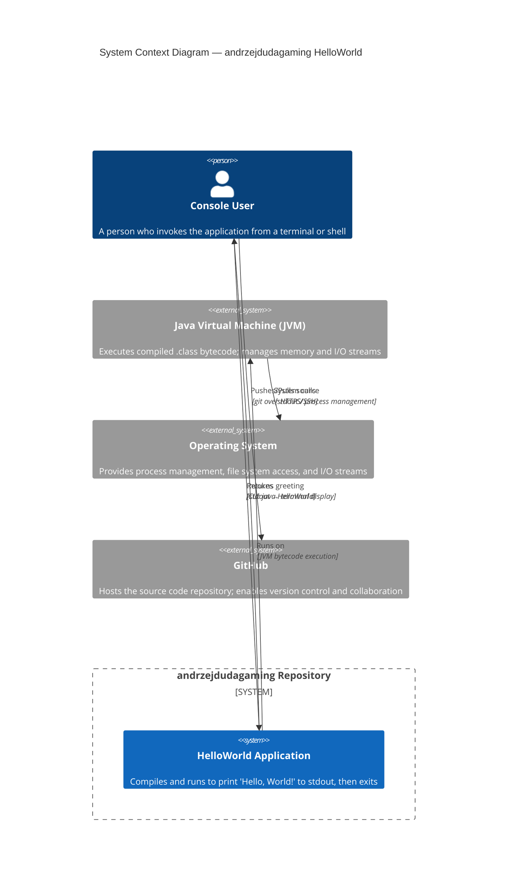

### 3.3 Scope Boundaries

**In scope:**
- Compilation of `HelloWorld.java` using `javac`
- Execution of the `main(String[] args)` method by the JVM
- Writing the greeting string to standard output (`System.out`)
- Version-controlling source files via Git

**Out of scope:**
- Networking / HTTP communication
- Persistence / databases / file I/O
- Graphical or web-based user interfaces
- Authentication or authorisation
- Multi-threading or concurrency
- External system integrations

---

## 4. Solution Strategy

> *Source analysis: `src/HelloWorld.java`*

The solution deliberately applies the **simplest possible implementation strategy**. Every technology and structural decision maps directly to a quality goal:

| Quality Goal        | Solution Approach                                                                          |
|---------------------|--------------------------------------------------------------------------------------------|
| **Simplicity**      | One class, one method, one statement — zero abstractions, zero frameworks                  |
| **Portability**     | Pure Java with no native code; standard JVM bytecode runs identically on all platforms     |
| **Maintainability** | `src/` directory separates source from workspace root; `.gitignore` keeps repository clean |
| **Correctness**     | `System.out.println()` guarantees a newline-terminated, auto-flushed output line           |

### Technology Stack Overview

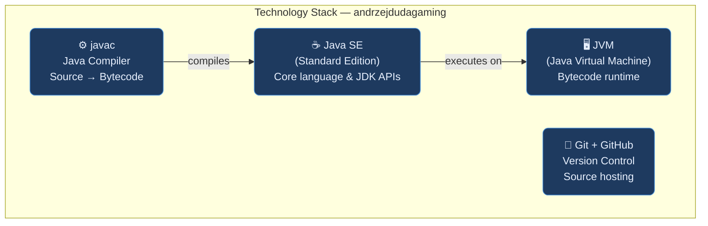

---

## 5. Building Block View

> *Source analysis: `src/HelloWorld.java` — AST structure*

### 5.1 Level 1 — Whitebox: Overall System

The entire deployable system consists of a **single Java class** with one static method.

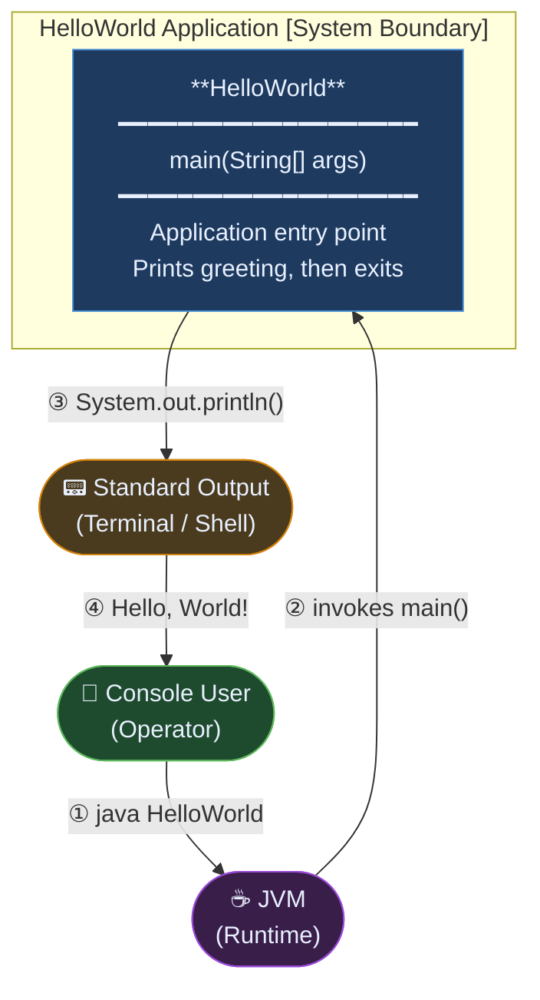

**Building Block Summary:**

| Block         | Responsibility                                                        | Interface              |
|---------------|-----------------------------------------------------------------------|------------------------|
| `HelloWorld`  | Application entry point; prints greeting and exits cleanly (code 0) | `main(String[] args)` |

---

### 5.2 Level 2 — Whitebox: HelloWorld Class Structure

```mermaid
classDiagram
    direction TB

    class HelloWorld {
        <<Application Entry Point>>
        +main(args : String[])$ void
    }

    class PrintStream {
        <<java.io.PrintStream>>
        +println(x : String) void
    }

    class System {
        <<java.lang.System>>
        +out : PrintStream$
        +err : PrintStream$
        +exit(status : int)$ void
    }

    class JVM {
        <<Runtime Environment>>
        +invokeMain(cls : Class) void
        +exit(code : int) void
    }

    JVM --> HelloWorld : «invokes» main()
    HelloWorld --> System : uses System.out
    System --> PrintStream : out : PrintStream
    HelloWorld --> PrintStream : println(Hello World!)

    note for HelloWorld "Single public class\nResides in default package\nNo instance state (fully static)\nNo constructors used"
    note for PrintStream "java.lang auto-imported\nAuto-flushed on println()\nWrites to terminal stdout"
```

**Class Details:**

| Class        | Package   | Modifier  | Method                  | Parameters    | Return | Fields |
|--------------|-----------|-----------|-------------------------|---------------|--------|--------|
| `HelloWorld` | (default) | `public`  | `main` (static)         | `String[] args` | `void` | none   |

---

### 5.3 Level 3 — Repository File Structure

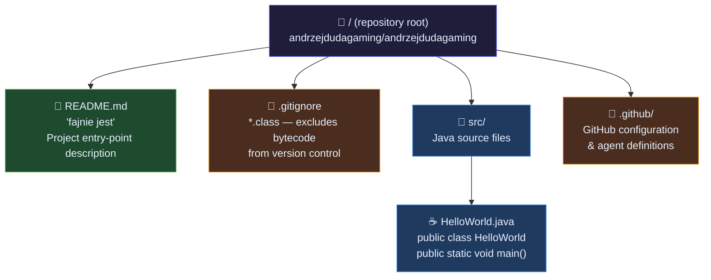

---

## 6. Runtime View

> *Source analysis: `src/HelloWorld.java` — execution trace*

### 6.1 Scenario 1 — Normal Execution (Happy Path)

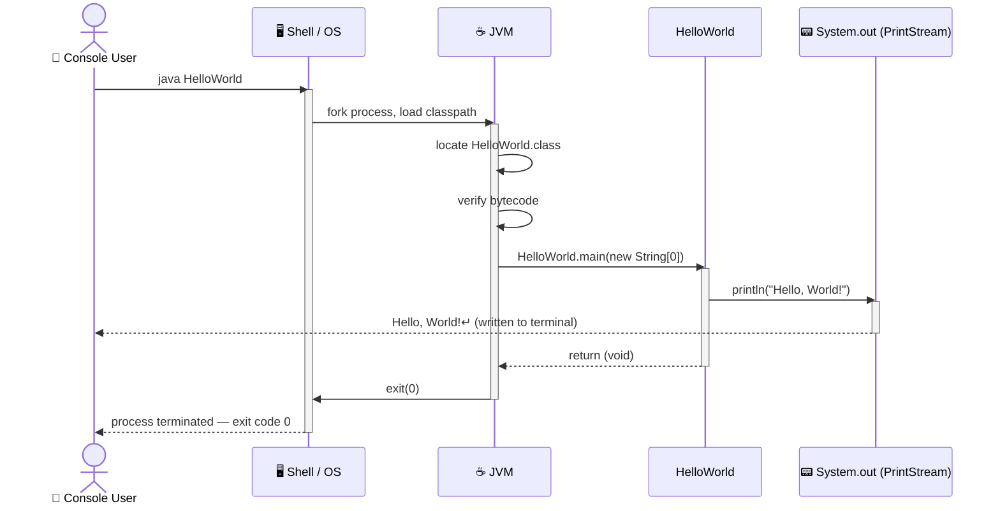

---

### 6.2 Scenario 2 — Error Case (Class Not Found)

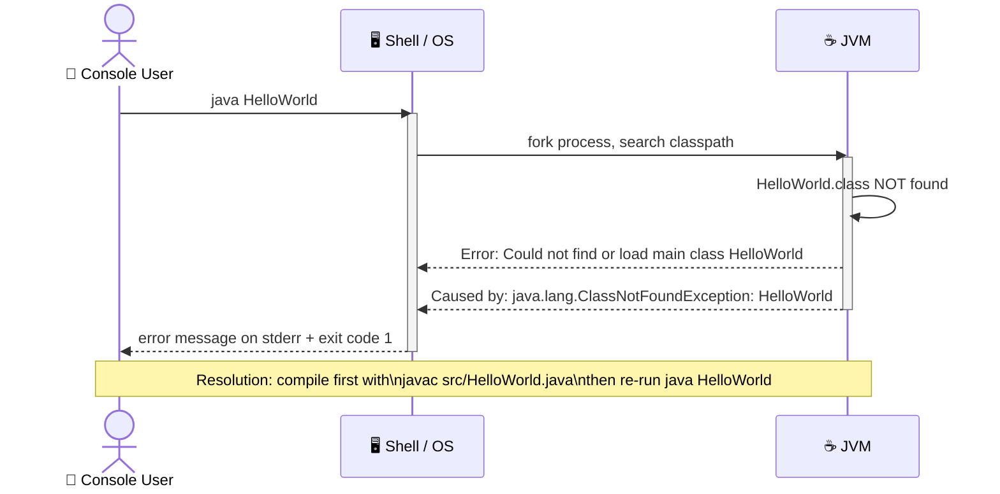

---

### 6.3 Complete Application Lifecycle

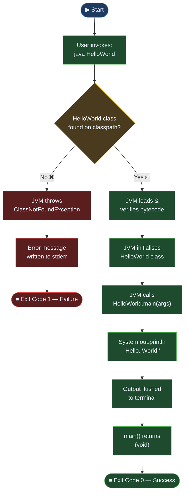

---

## 7. Deployment View

> *Source analysis: `.gitignore`, `src/HelloWorld.java`*

### 7.1 Infrastructure Requirements

| Requirement          | Minimum                             | Recommended                        |
|----------------------|-------------------------------------|------------------------------------|
| **Java (compile)**   | JDK 8+                              | JDK 21 LTS (latest LTS release)    |
| **Java (run only)**  | JRE 8+                              | JRE 21 LTS                         |
| **Operating System** | Any (Windows, macOS, Linux, BSD)    | Linux (best for CI/CD automation)  |
| **Disk Space**       | < 5 KB (source + bytecode combined) | N/A                                |
| **RAM**              | JVM default heap (≈ 64 MB min)      | N/A                                |
| **Build Tool**       | `javac` (included in JDK)           | Maven or Gradle (future state)     |
| **Network**          | Not required                        | N/A                                |

### 7.2 Deployment Topology

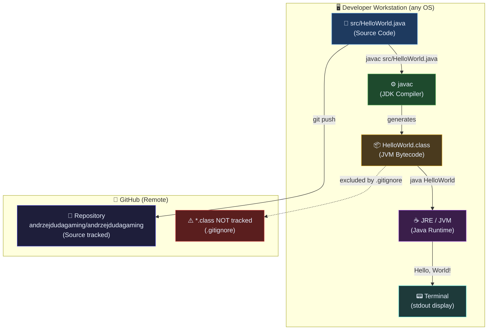

### 7.3 Build and Run Instructions

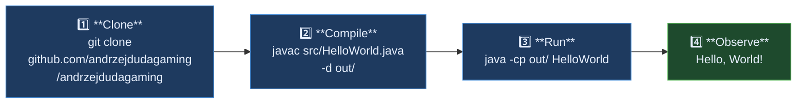

---

## 8. Crosscutting Concepts

> *Source analysis: `src/HelloWorld.java` — patterns, conventions, and concerns*

### 8.1 Domain Model

The domain is trivially simple — a single greeting message with no persistent state, no domain entities, and no value objects beyond the string literal.

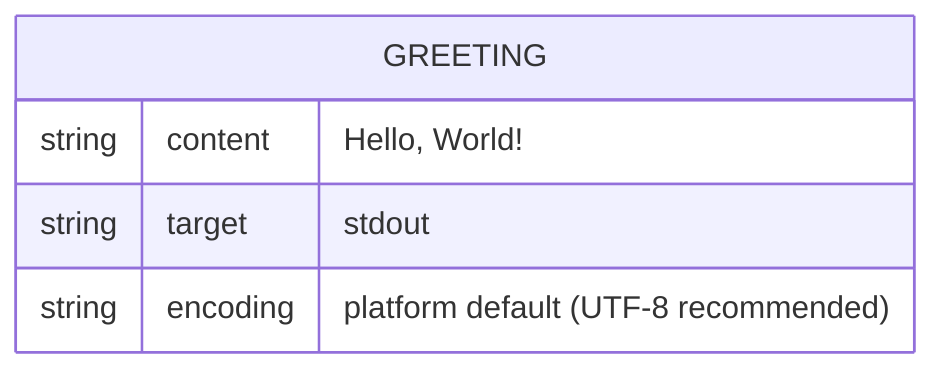

### 8.2 Architecture and Design Patterns

| Pattern                   | Applied? | Location / Description                                               |
|---------------------------|----------|----------------------------------------------------------------------|
| **Static Entry Point**    | ✅ Yes   | `public static void main(String[])` — standard Java idiom           |
| **Stateless Design**      | ✅ Yes   | No instance fields; no mutable shared state whatsoever              |
| **Command-Line Interface**| ✅ Yes   | `String[] args` parameter provides hook for future argument parsing |
| **Single Responsibility** | ✅ Yes   | The class does exactly one thing: print a greeting                  |
| **Singleton**             | ❌ N/A   | No instances created; all logic is static                           |
| **Factory / Builder**     | ❌ N/A   | No object construction beyond JVM bootstrapping                     |
| **Observer / Event**      | ❌ N/A   | No event model needed for single-statement execution                |

### 8.3 Error Handling Strategy

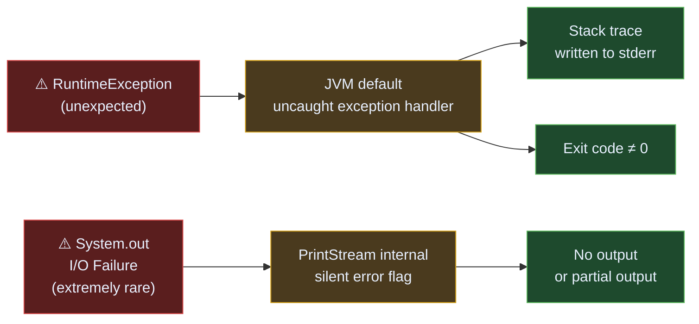

> **Current state**: No explicit `try/catch` blocks. The application relies entirely on JVM default error handling. This is acceptable for a Hello World program but must be addressed before any production use.

### 8.4 Logging and Observability

| Aspect           | Current State                            | Recommended (for future growth)      |
|------------------|------------------------------------------|--------------------------------------|
| **Logging**      | `System.out.println` (direct stdout)     | SLF4J API + Logback implementation   |
| **Metrics**      | None                                     | Micrometer + Prometheus              |
| **Tracing**      | None                                     | OpenTelemetry SDK                    |
| **Health Check** | None (exit code only)                    | Spring Actuator / custom endpoint    |

### 8.5 Internationalisation (i18n)

The greeting `"Hello, World!"` is a **hardcoded English string literal**. No i18n support exists. For future internationalisation, the string should be externalised into a `ResourceBundle`:

```java
// Future i18n approach:
ResourceBundle bundle = ResourceBundle.getBundle("messages", Locale.getDefault());
System.out.println(bundle.getString("greeting"));
```

### 8.6 Security Considerations

| Concern                  | Assessment                                                          |
|--------------------------|---------------------------------------------------------------------|
| **Input validation**     | `args` array is accepted but never read — no injection risk        |
| **Output sanitisation**  | Hardcoded literal only — no user-controlled data output             |
| **Dependencies**         | Zero external dependencies — zero third-party CVE surface          |
| **Secrets / credentials**| None present — no sensitive data in source code                     |

---

## 9. Architecture Decisions

> *Key architectural choices identified from code and project structure analysis*

---

### ADR-001: Single-Class Application Structure

| Field                        | Value                                                                       |
|------------------------------|-----------------------------------------------------------------------------|
| **Status**                   | ✅ Accepted                                                                  |
| **Date**                     | Project inception                                                           |
| **Context**                  | The application's only requirement is to print a static greeting string     |
| **Decision**                 | Implement as a single `public` class with a static `main` method            |
| **Rationale**                | Zero overhead; immediately recognisable Java idiom; no boilerplate needed   |
| **Consequences (positive)**  | Maximum simplicity; zero coupling to frameworks or abstractions             |
| **Consequences (negative)**  | Not scalable; must be refactored before any real feature is added           |

---

### ADR-002: No Build Automation Tool

| Field                        | Value                                                                             |
|------------------------------|-----------------------------------------------------------------------------------|
| **Status**                   | ✅ Accepted (for now)                                                              |
| **Date**                     | Project inception                                                                 |
| **Context**                  | No `pom.xml`, `build.gradle`, or `build.xml` is present                          |
| **Decision**                 | Use raw `javac` for compilation; no build tool                                   |
| **Rationale**                | A single-file project with zero dependencies does not warrant build tool overhead |
| **Consequences (positive)**  | No configuration files; faster project bootstrap                                 |
| **Consequences (negative)**  | Adding any dependency requires introducing a build tool; no reproducible builds  |

---

### ADR-003: Exclude Compiled Artefacts from Version Control

| Field                        | Value                                                                                         |
|------------------------------|-----------------------------------------------------------------------------------------------|
| **Status**                   | ✅ Accepted                                                                                    |
| **Date**                     | Project inception                                                                             |
| **Context**                  | Compiled `.class` files are regenerable and platform-specific in some edge cases             |
| **Decision**                 | Add `*.class` pattern to `.gitignore`                                                        |
| **Rationale**                | Follows standard Java project convention; keeps Git history clean; reduces repository size   |
| **Consequences (positive)**  | No binary blobs in Git history; repository size remains minimal                              |
| **Consequences (negative)**  | Recipients must compile the source before they can run the application                       |

---

### ADR-004: Use Default (Unnamed) Java Package

| Field                        | Value                                                                                   |
|------------------------------|-----------------------------------------------------------------------------------------|
| **Status**                   | ✅ Accepted (for now)                                                                    |
| **Date**                     | Project inception                                                                       |
| **Context**                  | `HelloWorld.java` declares no `package` statement                                       |
| **Decision**                 | Reside in the unnamed default package                                                   |
| **Rationale**                | Acceptable for a single-class demo; simplifies `javac` and `java` commands             |
| **Consequences (positive)**  | Simpler compilation (`javac HelloWorld.java`) and execution (`java HelloWorld`)         |
| **Consequences (negative)**  | Cannot be imported by other packages; **must** be changed before project growth begins  |

---

## 10. Quality Requirements

> *Source: code assessment of `src/HelloWorld.java`*

### 10.1 Quality Tree

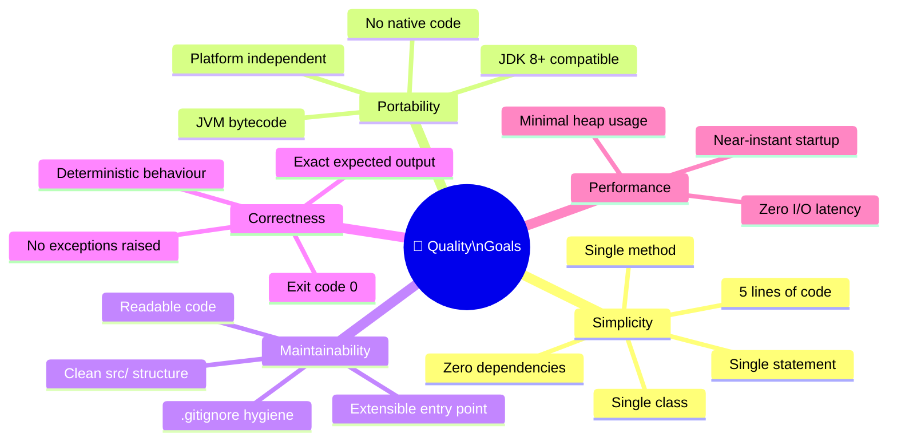

### 10.2 Quality Scenarios

| ID   | Quality          | Stimulus                                  | Response                                           | Measurable Criterion         |
|------|------------------|-------------------------------------------|----------------------------------------------------|------------------------------|
| QS-1 | Correctness      | User runs `java HelloWorld`               | Prints exactly `Hello, World!\n` to stdout         | 100% of executions           |
| QS-2 | Performance      | User invokes the application              | Output appears in the terminal                     | < 2 seconds (JVM startup)    |
| QS-3 | Portability      | Run on Windows / macOS / Linux            | Identical output on all supported platforms        | 0 platform-specific code     |
| QS-4 | Simplicity       | New Java developer reads the source       | Understands the entire program                     | < 30 seconds comprehension   |
| QS-5 | Maintainability  | Developer adds a second feature           | Existing structure accommodates extension          | No file renames required     |
| QS-6 | VCS hygiene      | Developer compiles and commits            | `.class` files do not appear in `git status`       | 0 unintended tracked binaries |

### 10.3 Code Quality Metrics

| Metric                        | Value   | Assessment                                   |
|-------------------------------|---------|----------------------------------------------|
| **Lines of Code (LoC)**       | 5       | ✅ Excellent — minimal and clean              |
| **Cyclomatic Complexity**     | 1       | ✅ Minimal — single linear path               |
| **Number of Classes**         | 1       | ✅ Single-class — appropriate for scope       |
| **Number of Methods**         | 1       | ✅ Single-method — no unnecessary abstraction |
| **External Dependencies**     | 0       | ✅ Zero deps — no supply-chain risk           |
| **Hardcoded String Literals** | 1       | ⚠️ Not externalised — limits i18n            |
| **Unit Test Coverage**        | 0%      | ❌ No tests present — must be addressed       |
| **JavaDoc Coverage**          | 0%      | ⚠️ No documentation comments on methods      |
| **Package Declaration**       | Missing | ⚠️ Default package — must change on growth   |

---

## 11. Risks and Technical Debt

> *Source: project structure analysis and code quality assessment*

### 11.1 Risk Register

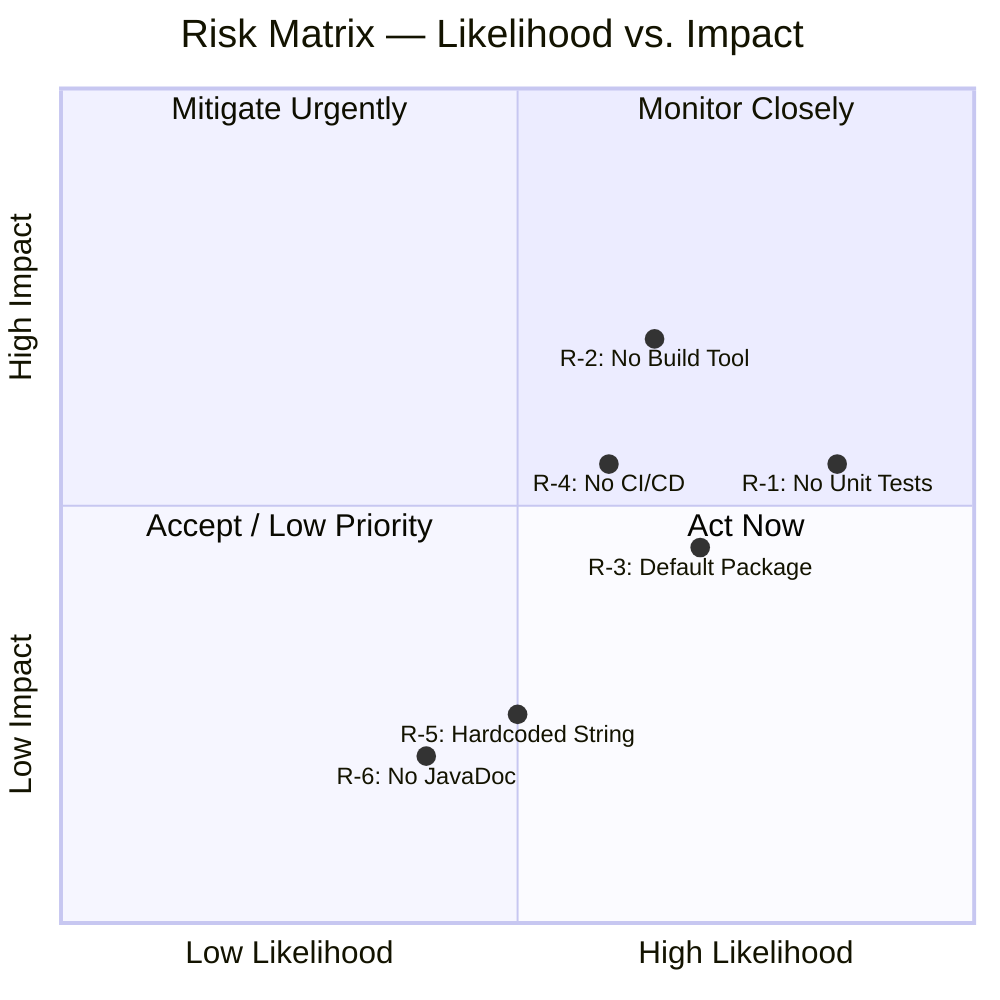

| ID  | Risk Description                       | Likelihood | Impact  | Risk Level | Mitigation Strategy                                                  |
|-----|----------------------------------------|------------|---------|------------|----------------------------------------------------------------------|
| R-1 | No unit tests — regressions undetected | High       | Medium  | 🔴 High    | Add JUnit 5; test `main()` output via `System.out` redirection       |
| R-2 | No build tool — scaling impossible     | High       | High    | 🔴 High    | Introduce Maven or Gradle when first dependency is required          |
| R-3 | Default package — prevents code reuse  | High       | Medium  | 🟠 Medium  | Add `package com.andrzejdudagaming;` declaration                     |
| R-4 | No CI/CD — manual error-prone process  | Medium     | Medium  | 🟠 Medium  | Add `.github/workflows/build.yml` with compile + test steps          |
| R-5 | Hardcoded greeting string              | Medium     | Low     | 🟡 Low     | Externalise to `ResourceBundle` or CLI argument                      |
| R-6 | No JavaDoc on public API               | Low        | Low     | 🟢 Low     | Add `/** ... */` doc comment to `main()` method                      |

### 11.2 Technical Debt Inventory

| ID   | Debt Item                              | Category        | Effort  | Priority | Recommended Action                                           |
|------|----------------------------------------|-----------------|---------|----------|--------------------------------------------------------------|
| TD-1 | No unit tests                          | Testing         | Low     | 🔴 High  | Create `test/HelloWorldTest.java` with JUnit 5               |
| TD-2 | No build tool / build descriptor       | Build & CI      | Low     | 🔴 High  | Add `pom.xml` (Maven) or `build.gradle` (Gradle)             |
| TD-3 | No CI/CD GitHub Actions workflow       | Build & CI      | Low     | 🟠 Medium| Create `.github/workflows/build.yml`                         |
| TD-4 | Default (unnamed) package              | Architecture    | Low     | 🟠 Medium| Add `package com.andrzejdudagaming;` to `HelloWorld.java`    |
| TD-5 | Greeting string is hardcoded           | Maintainability | Low     | 🟡 Low   | Externalise to `src/main/resources/messages.properties`      |
| TD-6 | No JavaDoc / code comments             | Documentation   | Very Low| 🟡 Low   | Add `/** Prints greeting to stdout */` on `main()`           |
| TD-7 | No `.editorconfig` or code style config| Conventions     | Very Low| 🟢 Low   | Add `.editorconfig` for consistent formatting across editors |

### 11.3 Recommended Evolution Path

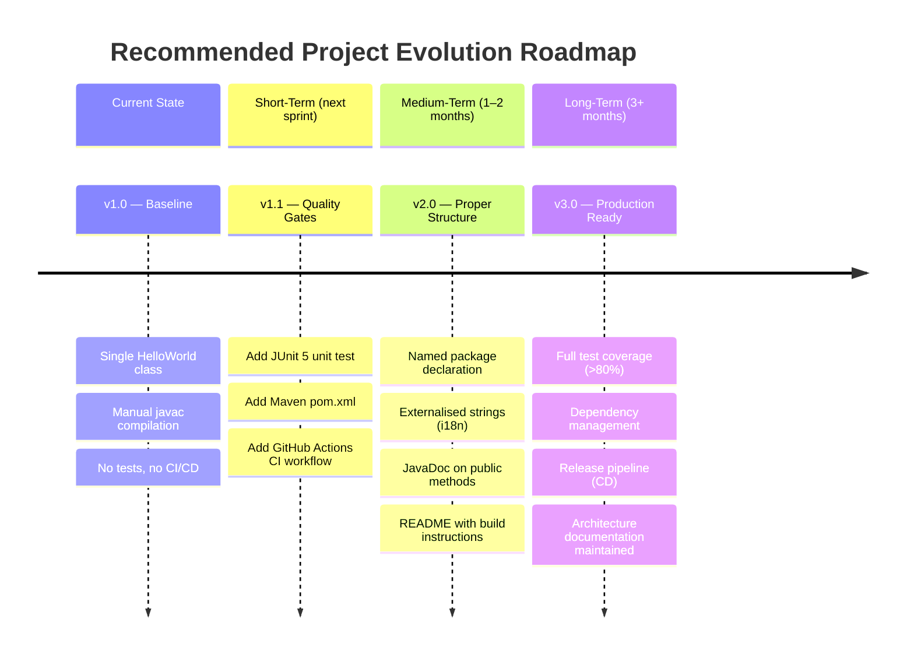

---

## 12. Glossary

> *Domain and technical terms used throughout this document, in alphabetical order*

| Term                      | Definition                                                                                              |
|---------------------------|---------------------------------------------------------------------------------------------------------|
| **ADR**                   | Architecture Decision Record — a short document capturing an important architectural choice and its rationale |
| **andrzejdudagaming**     | The GitHub username and project owner; also the repository name and project identifier                  |
| **Arc42**                 | A practical, open-source template for software architecture documentation with 12 standardised sections |
| **args**                  | The `String[]` parameter of `main()`; holds command-line arguments passed by the user at startup       |
| **bytecode**              | Platform-neutral intermediate representation of Java source code, stored in `.class` files             |
| **CI/CD**                 | Continuous Integration / Continuous Deployment — automated pipelines for building, testing, and releasing |
| **classpath**             | A list of directories/JARs where the JVM searches for `.class` files at runtime                        |
| **Cyclomatic Complexity** | A code metric counting linearly independent paths through a method; value of 1 = single path            |
| **default package**       | Java classes with no `package` declaration reside in the unnamed (default) package                     |
| **exit code**             | An integer returned by a process to the OS upon termination; `0` = success, non-zero = error            |
| **fajnie jest**           | Polish: _"it's cool"_ / _"it's nice"_ — the project's motto from `README.md`                           |
| **Git**                   | A distributed version control system used to track changes in source code                               |
| **.gitignore**            | A Git configuration file listing patterns of files and directories to exclude from version tracking     |
| **GitHub**                | A cloud platform that hosts Git repositories and provides collaboration features                         |
| **Hello, World!**         | A traditional first program in many programming languages; confirms the basic toolchain is working      |
| **i18n**                  | Internationalisation — the design practice of making software adaptable to different languages/locales  |
| **javac**                 | The Java compiler bundled with the JDK; converts `.java` source files to `.class` bytecode files        |
| **JDK**                   | Java Development Kit — includes the compiler (`javac`), the JRE, and development tools                 |
| **JRE**                   | Java Runtime Environment — subset of the JDK; sufficient to *run* (not compile) Java programs          |
| **JUnit 5**               | The current major version of the JUnit Java testing framework                                           |
| **JVM**                   | Java Virtual Machine — the runtime engine that executes Java bytecode on the host operating system      |
| **LoC**                   | Lines of Code — a basic metric for measuring software size                                              |
| **main method**           | `public static void main(String[] args)` — the conventional and required entry point of a Java app      |
| **Maven**                 | A popular Java build automation and dependency management tool using `pom.xml` configuration            |
| **PrintStream**           | `java.io.PrintStream` — the class backing `System.out`; provides `print()` and `println()` methods     |
| **ResourceBundle**        | A Java mechanism (`java.util.ResourceBundle`) for externalising locale-specific strings                 |
| **SLF4J**                 | Simple Logging Facade for Java — a logging abstraction API; recommended over `System.out` for real apps |
| **static method**         | A method belonging to the class itself (not an instance); callable without object instantiation         |
| **stderr**                | Standard Error — the error output stream of a process, separate from stdout                             |
| **stdout**                | Standard Output — the default output stream of a process, typically displayed in the terminal           |
| **System.out.println**    | Java standard library call that writes a string followed by a platform-specific newline to stdout       |

---

*— End of Arc42 Architecture Documentation —*

---
*Generated by **Arc42 Documentation Generator***  
*Project: **andrzejdudagaming/andrzejdudagaming***  
*Document covers: `README.md` · `src/HelloWorld.java` · `.gitignore`*
